# Grafix

Grafix is a Python-based creative coding framework compatible with pen plotter.


## Installation

```bash
pip install grafix
```

macOS-first. Tested on macOS (Apple Silicon). Other platforms are not officially supported yet.

## Quick start

```python
from grafix import E, G, run


def draw(t: float):
    poly = G.polyhedron()
    effect = E.fill().subdivide().displace().rotate(rotation=(t * 6, t * 5, t * 4))
    return effect(poly)


if __name__ == "__main__":
    run(draw, canvas_size=(148, 210), render_scale=5.0)
```

## Examples

<!-- BEGIN:README_EXAMPLES_GRN -->
<table>
  <tr>
    <td>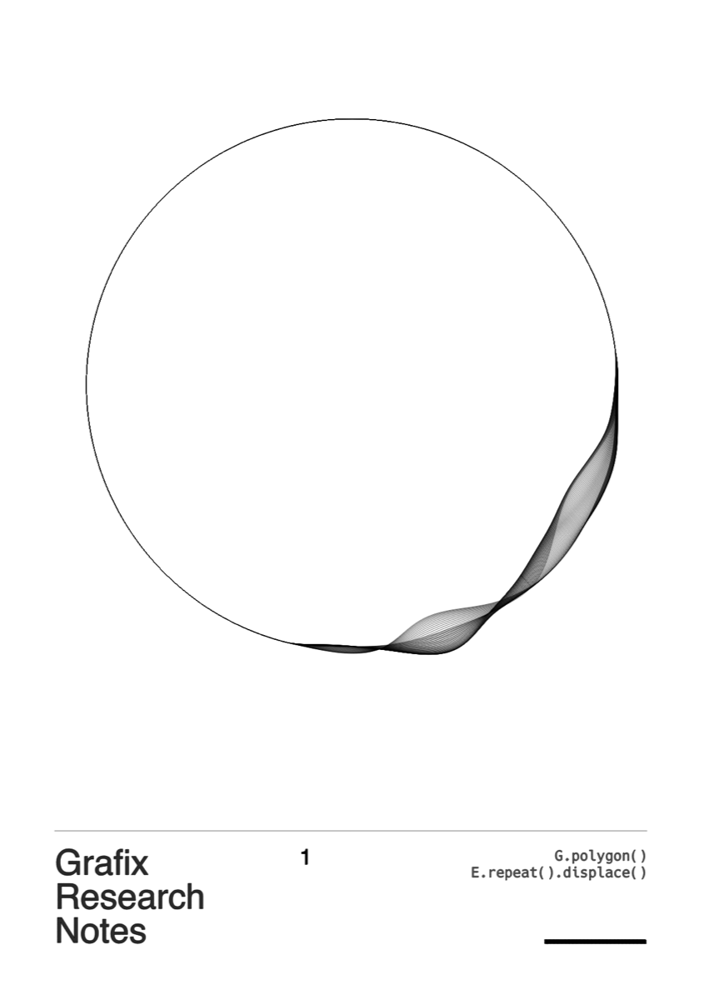</td>
    <td>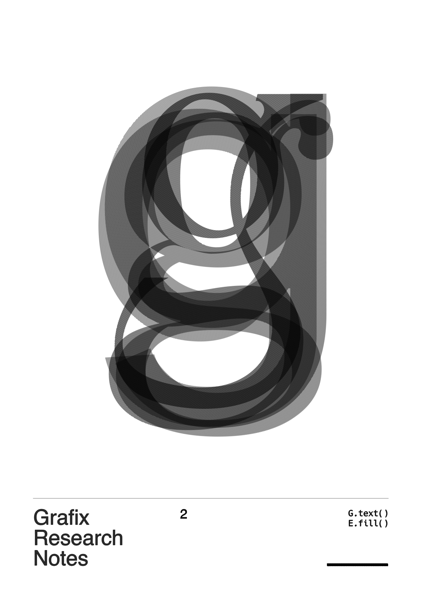</td>
    <td>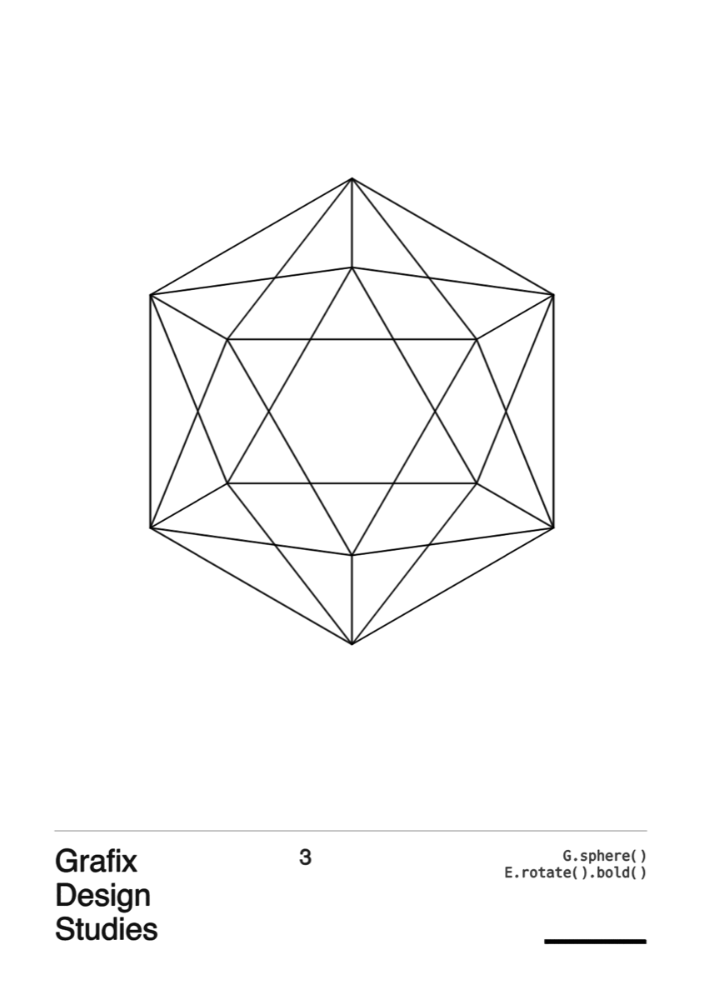</td>
  </tr>
  <tr>
    <td>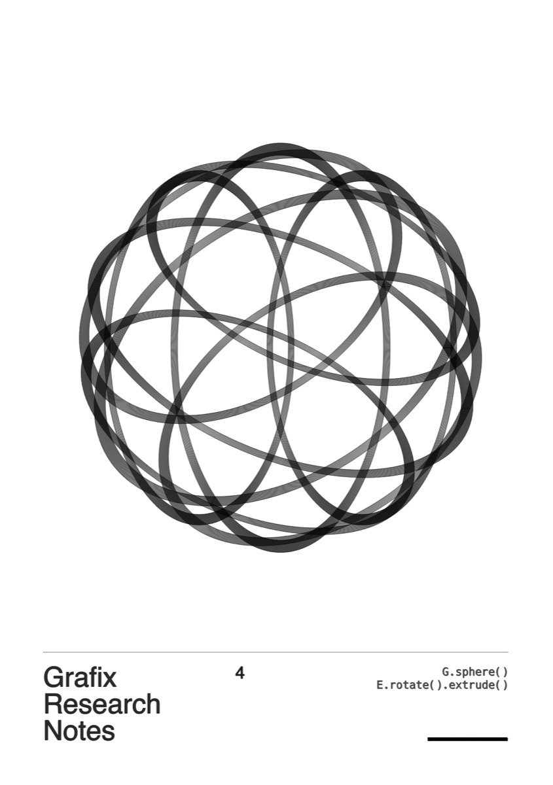</td>
    <td>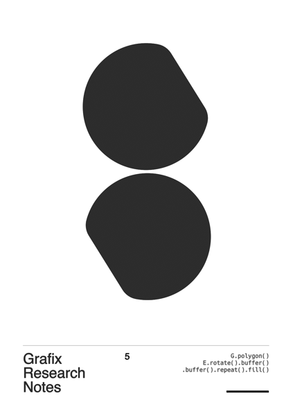</td>
    <td>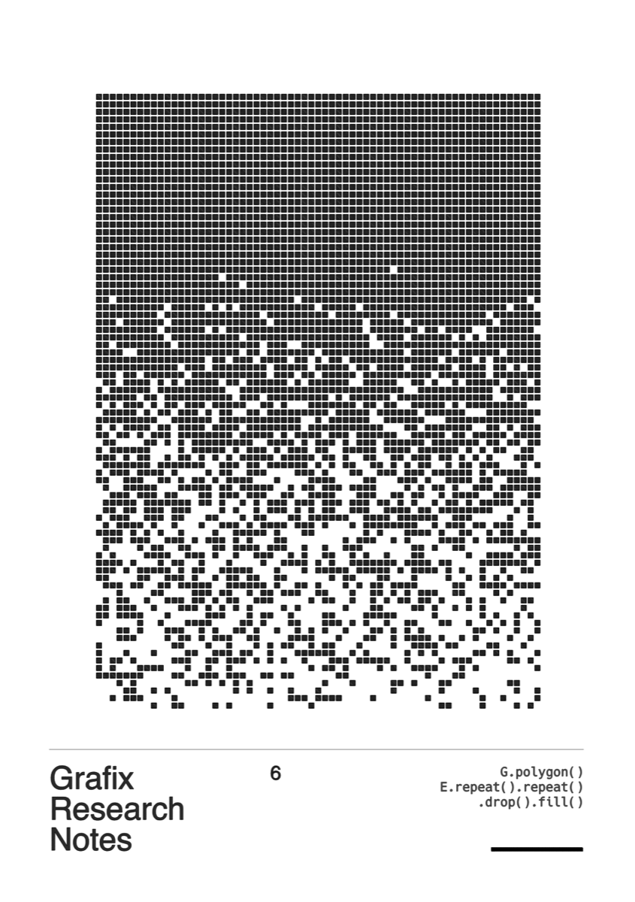</td>
  </tr>
  <tr>
    <td>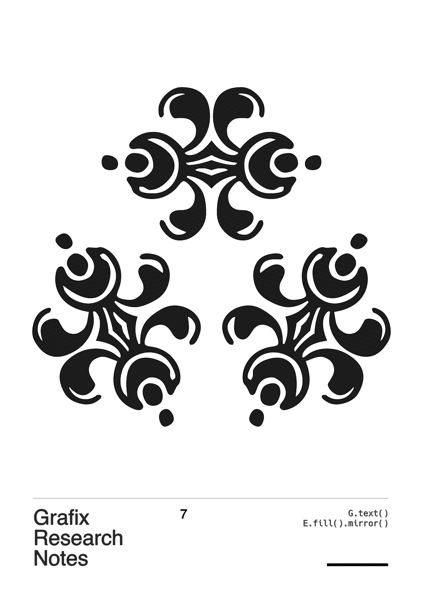</td>
    <td>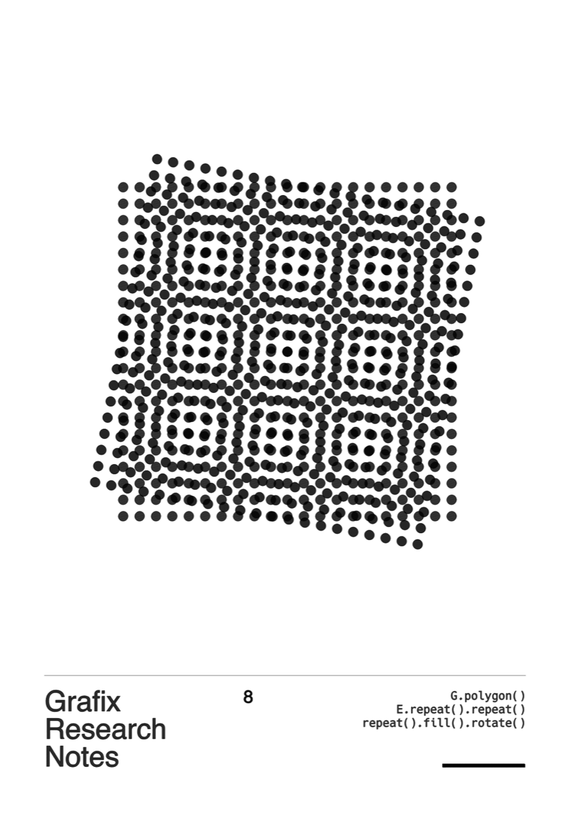</td>
    <td>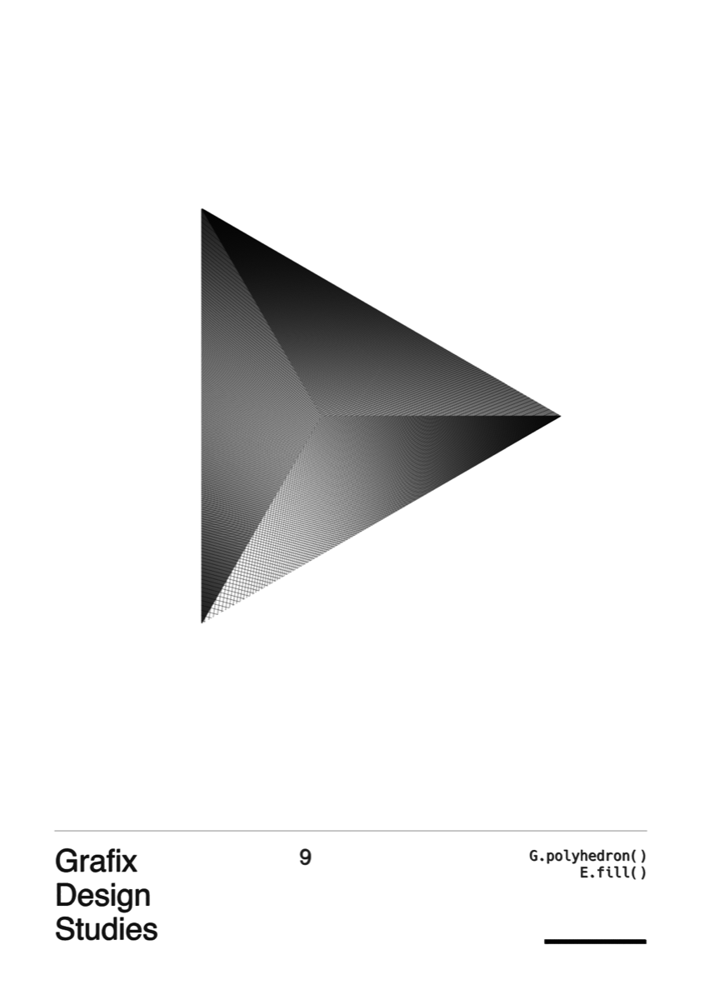</td>
  </tr>
  <tr>
    <td>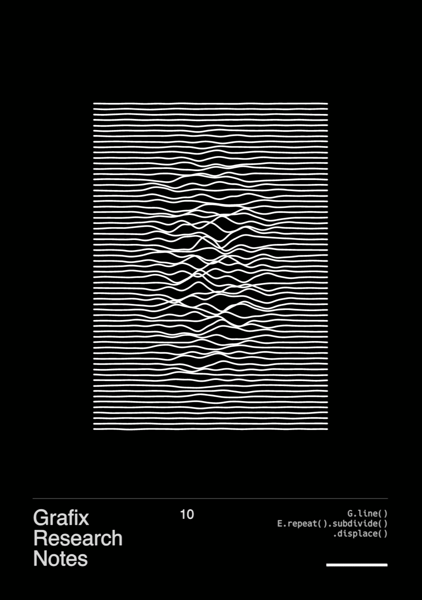</td>
    <td>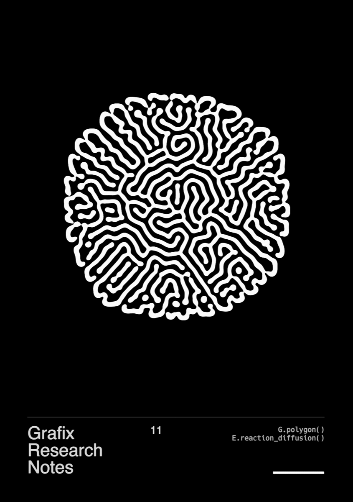</td>
    <td>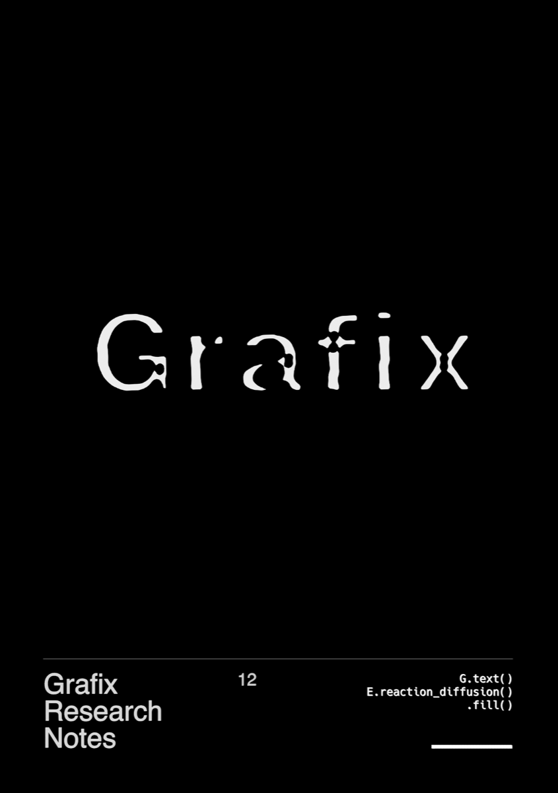</td>
  </tr>
  <tr>
    <td>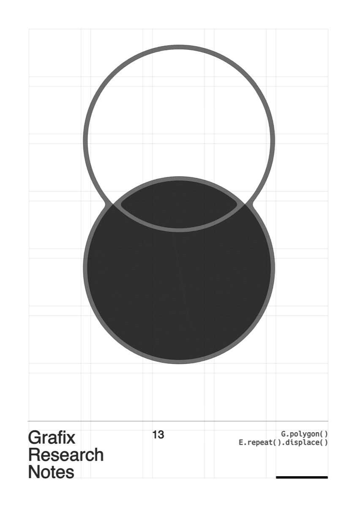</td>
    <td>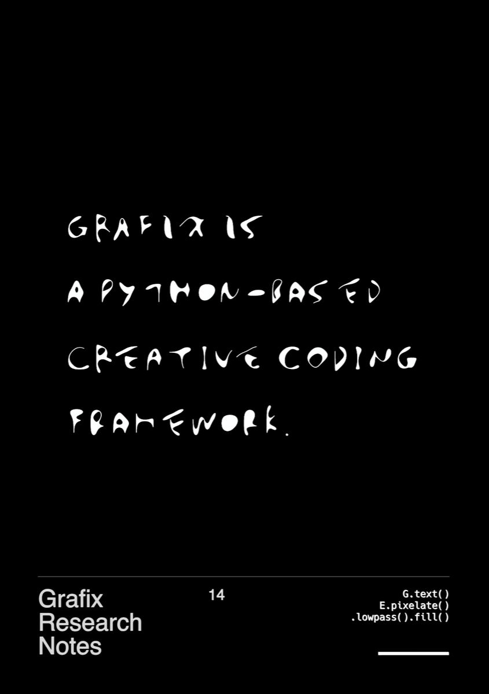</td>
    <td>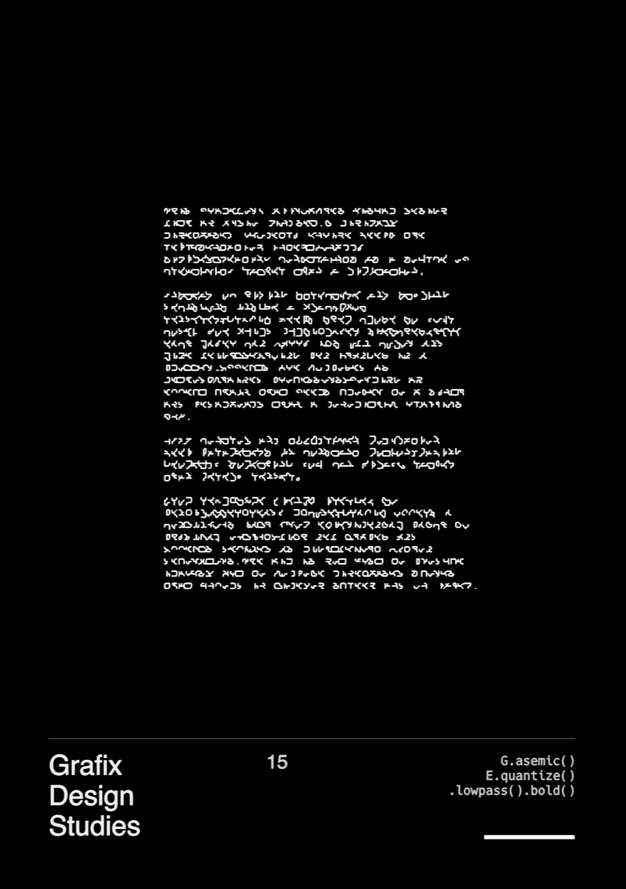</td>
  </tr>
</table>
<!-- END:README_EXAMPLES_GRN -->

## Core API

- `G` lets you generate primitives such as `sphere`, `polyhedron`, `grid`, and more.
- `E` lets you modulate primitives such as `affine`, `fill`, `repeat`, and more.
- `run` lets you render a user-defined `draw(t)` function on each frame.

## Optional features

- `L` lets you define layers (stroke color, thickness, etc.).
- `cc` lets you map MIDI CC messages to any parameter.
- `@primitive` lets you register custom primitives (they become available under `G`).
- `@effect` lets you register custom effects (they become available under `E`).
- `@preset` lets you register reusable components (only selected params are exposed to the Parameter GUI).
- `P` lets you call registered presets as `P.<name>(...)`.
- `Export` provides a headless export entrypoint.
- `Parameter GUI` lets you tweak parameters live while the sketch is running.
- Keyboard shortcuts let you export output quickly:
  - `P` saves a `.png` image
  - `S` saves a `.svg` file
  - `V` records an `.mp4` video
  - `G` saves a `.gcode` file for pen plotters

## Extending (custom primitives / effects)

You can register your own primitives and effects via decorators:

```python
from grafix.api import effect, primitive


@primitive
def user_prim(*, r=10.0):
    ...


@effect
def user_eff(inputs, *, amount=1.0):
    ...
```

Notes:

- Built-in primitives/effects must provide `meta=...` (enforced).
- For user-defined ops, `meta` is optional. If omitted, parameters are not shown in the Parameter GUI.

## Presets (reusable components)

Use `@preset` to register a component, and call it via `P.<name>(...)`:

```python
from grafix import P, preset


@preset(meta={"scale": {"kind": "float", "ui_min": 0.1, "ui_max": 10.0}})
def logo(*, scale: float = 1.0, name=None, key=None):
    ...


P.logo(scale=2.0)
```

For IDE completion of `P.<name>(...)`, regenerate stubs after adding/changing presets:

```bash
python -m grafix stub
```

## Configuration

A `config.yaml` lets you locate external fonts and choose where Grafix writes runtime outputs (`.svg`, `.png`, `.mp4`, `.gcode`).

Grafix starts from the packaged defaults (`grafix/resource/default_config.yaml`) and then overlays user configs.

Config overlay order (later wins):

- packaged defaults: `grafix/resource/default_config.yaml`
- `./.grafix/config.yaml` (project-local)
- `~/.config/grafix/config.yaml` (per-user)
- `run(..., config_path="path/to/config.yaml")`

Paths support `~` and environment variables like `$HOME`.

To create a project-local config (starting from the packaged defaults):

```bash
mkdir -p .grafix
python -c "from importlib.resources import files; print(files('grafix').joinpath('resource','default_config.yaml').read_text())" > .grafix/config.yaml
$EDITOR .grafix/config.yaml
```

To autoload user presets from a directory:

```yaml
paths:
  preset_module_dirs:
    - "sketch/presets"
```

To prioritize MIDI device connections when using `midi_port_name="auto"`:

```yaml
midi:
  inputs:
    - port_name: "Grid"
      mode: "14bit"
    - port_name: "TX-6 Bluetooth"
      mode: "7bit"
    - port_name: "auto"
      mode: "7bit"
```

## Not implemented yet

- LFOs to modulate any parameters with rhythm

## Development

### Geometry (the core data model)

Grafix is built around an immutable `Geometry` node, which represents a _recipe_ (not yet realized polylines).
Nodes form a DAG (directed acyclic graph):

- `op`: the operator name (primitive/effect/concat are stored uniformly)
- `inputs`: child `Geometry` nodes (empty for primitives)
- `args`: normalized `(name, value)` pairs
- `id`: a content-based signature derived from `(op, inputs, args)`

Primitives (`G.*`) create leaf `Geometry` nodes. Effects (`E.*`) take one or more input `Geometry`s and return a new `Geometry`
that references them. Chaining operations in `draw(t)` builds the DAG.

When `parameter_gui` is enabled, the GUI edits the parameters (`args`) of ops. Updating a parameter creates new `Geometry` nodes
with new `id`s, while unchanged subgraphs keep their `id`s — which makes caching/reuse straightforward during interactive previews.

### RealizedGeometry (what primitives/effects compute)

Evaluating the `Geometry` DAG produces `RealizedGeometry`, a compact polyline representation:

- `coords`: `np.ndarray` of `float32`, shape `(N, 3)` (x, y, z). A 2D `(N, 2)` array is also accepted (z=0 is implied).
- `offsets`: `np.ndarray` of `int32`, shape `(M+1,)`, where polyline `i` is `coords[offsets[i]:offsets[i+1]]`.
  `offsets[0]` is `0` and `offsets[-1]` equals `N`.

Custom primitives return a `RealizedGeometry`. Custom effects take `Sequence[RealizedGeometry]` (usually 1 input) and return a new
`RealizedGeometry`. Treat input arrays as immutable (`writeable=False`) and avoid in-place mutation.

Dev tools (optional):

```bash
pip install -e ".[dev]"
```

Run a sketch:

```bash
python sketch/readme.py
```

List built-in ops:

```bash
python -m grafix list effects
python -m grafix list primitives
python -m grafix list
```

Regenerate API stubs (for `P.<name>(...)` completion):

```bash
python -m grafix stub
```

Headless export (PNG):

```bash
python -m grafix export --callable your_module:draw --t 0.0
python -m grafix export --callable your_module:draw --t 0.0 1.0 2.0 --out-dir data/output
```

Note: `--callable module:attr` follows Python import rules (make sure the module is importable from your current working directory / `PYTHONPATH`).

Benchmark (effect perf + report):

```bash
python -m grafix benchmark -- --help
```

## Dependencies

Core (default):

- numpy
- numba
- shapely
- pyclipper
- moderngl
- pyglet
- imgui
- fontPens
- fontTools
- PyYAML
- mido
- python-rtmidi
- psutil

External:

- resvg (svg to png)
- ffmpeg (video encoding)

Dev (optional):

- pytest
- ruff
- mypy
