<!--
どこで: `docs/architecture_visualization.md`。
何を: 現行 `src/grafix/` の依存方向、snapshot、resource ownership、主要 flow の Mermaid 図。
なぜ: 実装を読む前に、state と変更理由の境界を視覚的に確認できるようにするため。
-->

# Grafix アーキテクチャ可視化

## 1. レイヤと依存方向

矢印は compile/runtime dependency の許可方向を表す。user sketch への callback と、decorator が
scoped registration target へ declaration を渡す流れだけはラベルで区別する。

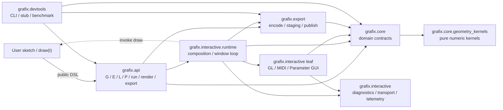

禁止する逆依存:

- `core -> api/export/interactive`
- `export -> api/interactive`
- `interactive -> api`
- `interactive` の GL/MIDI/GUI leaf `-> interactive.runtime`
- `core -> subprocess/fsync/publish/output-path policy`

`tests/architecture/test_dependency_boundaries.py` が import と主要 private reach-through を検査する。

## 2. Authoring から immutable catalog まで

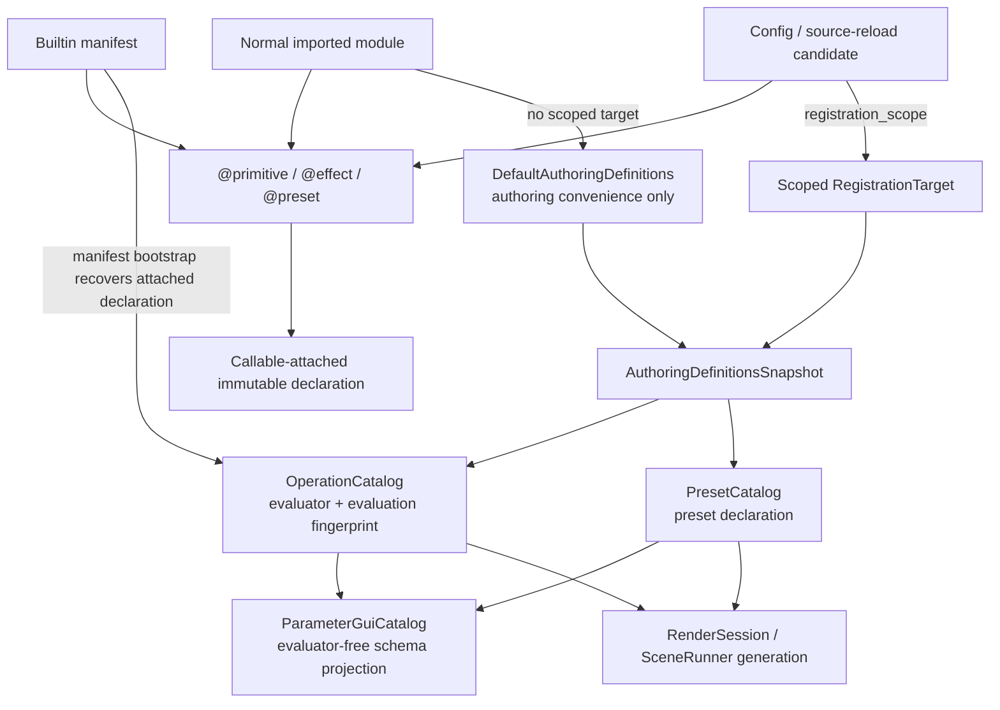

重要な規則:

- decorator は live evaluator registry を変更しない。
- builtin declaration は default authoring store に入らず、manifest だけが bootstrap する。
- candidate は隔離した target 内で全体を構築し、成功時だけ snapshot を採用する。
- draw の外側の `P` は default authoring preset だけを参照し、config directory を暗黙 load しない。
- session/generation は構築後に default store の変更を観測しない。

## 3. Geometry identity と評価 cache

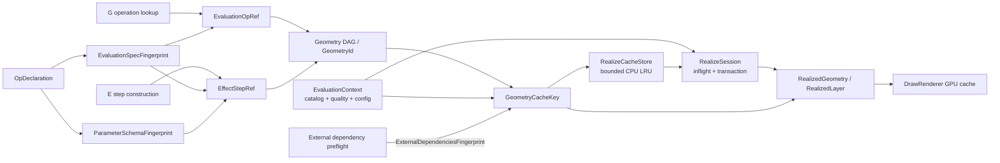

`GeometryId` は使用した operation ref を推移的に含む。realize は catalog の exact ref を検証し、
同名別 version へ fallback しない。schema だけの変更や未使用 operation の変更は geometry cache
identity に含めない。

## 4. Session / generation の resource ownership

### Headless composition

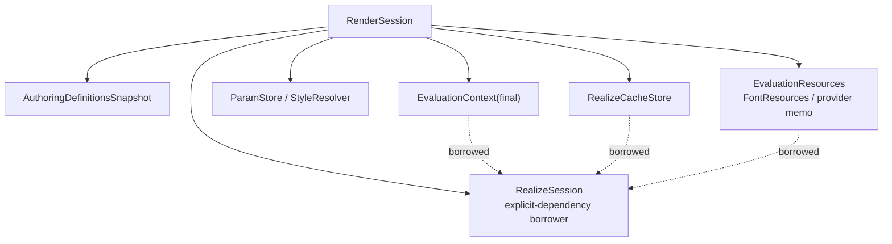

close 順は `RealizeSession -> EvaluationResources -> RealizeCacheStore`。

### Low-level RealizeSession

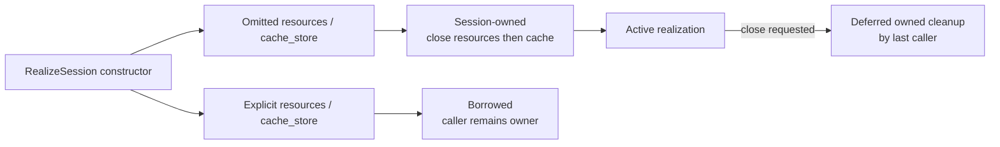

`resources` と `cache_store` はそれぞれ独立に owned/borrowed を選ぶ。active caller がなければ
owned cleanup は `close()` で直ちに行う。`EvaluationContext` は immutable value で close 対象ではない。
constructor/body/close の `BaseException` でも後続 owned cleanup を試し、最初の error を保持する。

### Interactive reload

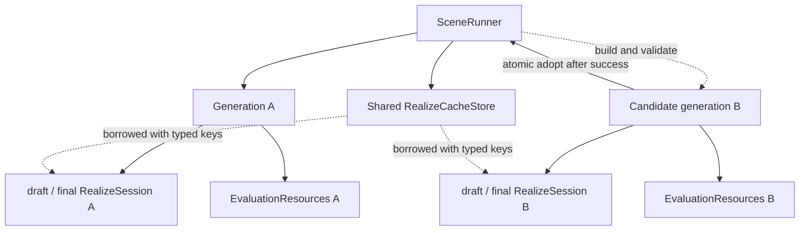

新 generation の構築に失敗した場合は A を維持する。採用後に旧子 session、旧 resource を閉じ、
共有 cache は `SceneRunner` 終了時だけ閉じる。

## 5. Parameter の読み取りと更新

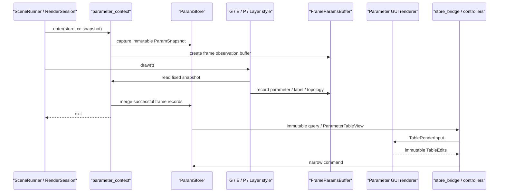

通常 command:

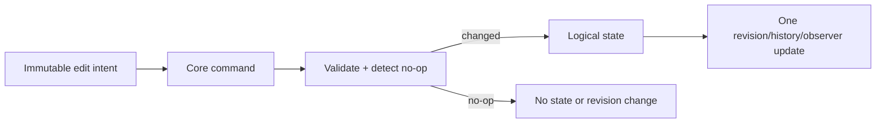

一時 rollback:

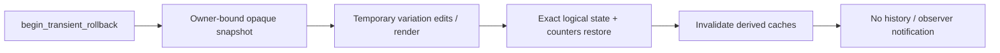

API/interactive が `ParamStore` の live/private container を取得する経路はない。
`ParamRuntimeView` は生成時に runtime mapping を浅く copy した時点固定 snapshot であり、後続 frame の
mutation を既存 view が観測しない。mapping 内の key/value/source は canonical immutable value である。

## 6. Interactive の一 frame

```mermaid
sequenceDiagram
    participant Loop as "MultiWindowLoop"
    participant DWS as "DrawWindowSystem"
    participant Transport as "TransportClock"
    participant MIDI as "MidiSession"
    participant SR as "SceneRunner"
    participant Pipe as "realize_scene"
    participant GL as "DrawRenderer"
    participant Rec as "RecordingSession"
    participant Capture as "CaptureQueue"
    participant GUI as "ParameterGUIWindowSystem"

    loop every frame
        par Preview window
            Loop->>DWS: draw_frame()
            DWS->>Transport: sample time
            DWS->>MIDI: poll and immutable snapshot
            DWS->>SR: run(t, quality, ParamStore, MIDI)
            SR->>Pipe: draw / normalize / style / realize
            Pipe-->>SR: RealizedLayer tuple
            SR-->>DWS: last-good or fresh scene
            DWS->>GL: begin_frame + render layers
            DWS->>Rec: optional RGB24 frame
            DWS->>Capture: admit / poll export work
        and Inspector window
            Loop->>GUI: draw_frame()
            GUI->>GUI: backend begin_frame -> panels -> render
        end
    end
```

`DrawWindowSystem` は順序と配線を担当し、capture path/publish、recording restore、workspace policy は
それぞれ `CaptureQueue`、`RecordingSession`、`WorkspaceWindowController` が所有する。

## 7. Render と capture publish

```mermaid
flowchart LR
    draw["draw(t) + config + parameter source"]
    render["RenderSession<br/>final evaluation"]
    frame["Immutable Frame"]
    adapter["grafix.export API adapter"]
    service["CaptureService"]
    encoder["SVG / PNG / G-code encoder"]
    staging["CaptureStaging"]
    publish["Atomic no-clobber publish"]
    files["Artifact family + capture manifest"]

    draw --> render --> frame
    frame --> adapter --> service
    service --> encoder --> staging --> publish --> files
```

`RenderSession.render()` はファイル I/O を行わない。publish は完成済み private staging を使い、
late collision では再 encode せず別 version を試す。失敗時は今回の generation だけを rollback する。

## 8. G-code の semantic boundary

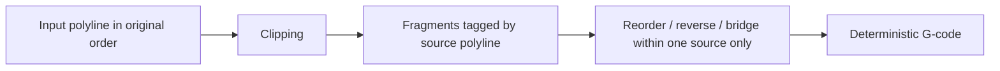

異なる input polyline 間は並べ替え、向き反転、pen-down bridge の対象にしない。頂点数や閉曲線
らしさから face/group を推測しない。

## 9. Benchmark harness の一方向 DAG

矢印は compile dependency の向き（依存元から依存先）を表す。

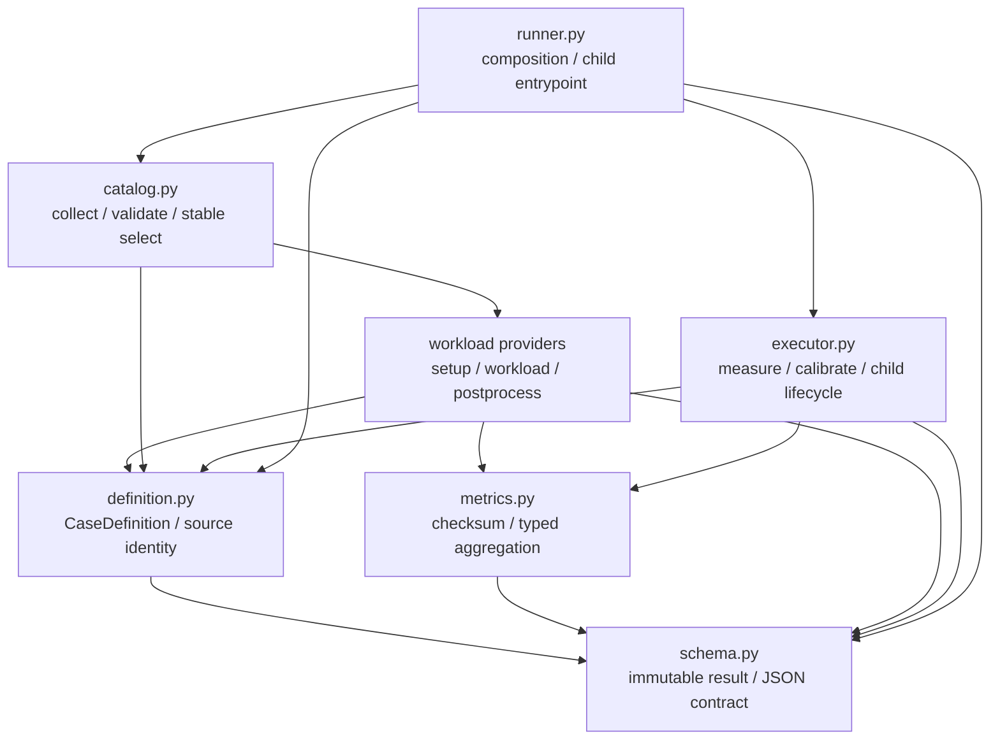

`runner.py` の公開 symbol は `run_case_isolated` だけである。親側は definition と executor を配線し、
child entrypoint は catalog で case ID を解決して executor へ渡す。executor は catalog/workload を
知らず、workload は catalog/executor/runner を知らない。workload layer 内で許可する依存は
`interactive_scenario -> parameter_hotpath / renderer` と `parameter_edit -> parameter_hotpath` の
public helperだけで、private provider symbol参照をarchitecture testが拒否する。旧runner symbolの
re-export shimはない。

## 10. 主な source of truth

| 概念 | 正本 |
|---|---|
| operation authoring | `core/operation_authoring.py`, `core/operation_declaration.py` |
| registration/snapshot | `core/authoring_definitions.py`, `core/authoring_loader.py` |
| operation/preset catalog | `core/operation_catalog.py`, `core/preset_catalog.py` |
| evaluation/cache/resource | `core/evaluation_context.py`, `core/realize.py`, `core/font_resources.py` |
| parameters | `core/parameters/` |
| scene pipeline | `core/pipeline.py` |
| interactive composition | `api/runner.py`, `interactive/runtime/` |
| GUI schema projection | `interactive/parameter_gui/catalog.py` |
| capture lifecycle | `export/capture.py`, `export/capture_staging.py`, `export/capture_publish.py` |
| numeric kernels | `core/geometry_kernels/` |
| benchmark definition/catalog/metrics/execution | `devtools/benchmarks/definition.py`, `catalog.py`, `metrics.py`, `executor.py` |
| benchmark workload/composition | `devtools/benchmarks/*_benchmark.py`, `devtools/benchmarks/runner.py` |
