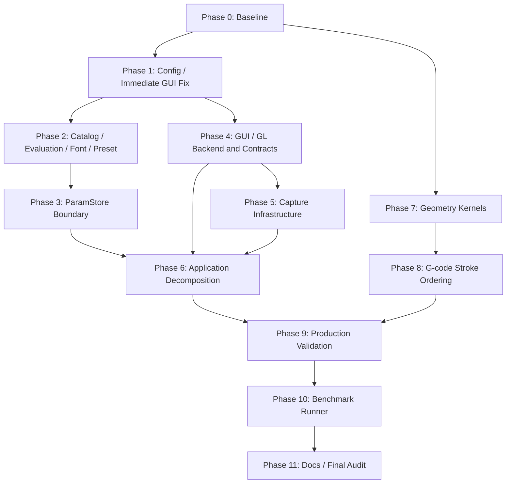

# `src/grafix` アーキテクチャ品質改善 実装計画（2026-07-21）

作成日: 2026-07-21

基準 HEAD: `74a8643`

根拠レビュー:
`docs/review/src_grafix_architecture_quality_review_2026-07-21.md`

ステータス: **コード実装・文書・自動検証完了（Phase 1〜11）。Mac のロックにより実機 GUI 操作と real OS/GL soak のみ一部未完了**

実装開始:

- ユーザー承認: 2026-07-21
- 実装開始 HEAD: `a2919e0`
- 実装開始時 `git status --porcelain`: clean
- `74a8643..a2919e0` の差分は docs / skill のみで、`src/`、`tests/`、`pyproject.toml`、`README.md`、`architecture.md` に production 差分がないことを確認した。

作成開始時の依頼外差分:

- `?? .agents/skills/grafix-art-loop/`
- `?? docs/plan/grafix_art_loop_llm_simplification_plan_2026-07-21.md`
- `?? docs/review/src_grafix_architecture_quality_review_2026-07-21.md`

上記は本計画の対象外とし、移動、削除、上書き、stage を行わない。

計画作成中には、別作業による以下の tracked deletion も追加で出現した。

- `.agents/skills/grafix-art-loop-artist/` 配下
- `.agents/skills/grafix-art-loop-critic/` 配下
- `.agents/skills/grafix-art-loop-ideaman/` 配下
- `.agents/skills/grafix-art-loop-orchestrator/` 配下

これらも本計画では一切変更せず、最終 status で依頼対象差分と分離する。

## 1. 目的

レビューの AQ-001〜AQ-012 を、局所的な workaround や互換 shim を追加せず、依存関係に沿って段階的に解消する。

最終的に、次の状態を実現する。

- 評価結果へ影響する quality、config、font asset、operation spec が cache identity に明示されている。
- `RenderSession` / `SceneRunner` が評価期間の immutable state と、明示的な lifetime を持つ cache/resource を所有し、子 `RealizeSession` はそれらを借用する。session lifetime を process-global state で表さない。
- config A/B、同名 preset A/B、draft/final、font asset A/B を同一 process で安全に共存させられる。
- `ParamStore` の mutation、history、revision、transactional rollback を `core.parameters` が所有し、API/GUI は private layout を知らない。
- `DrawWindowSystem`、`ParameterGUI`、`api.runner` は順序と composition を担当し、I/O や個別 state machine の詳細を持たない。
- effect 共通 kernel、capture infrastructure、interactive contract、benchmark runner が概念単位で分かれている。
- registry 登録経路が一つで、selector metadata と evaluator catalog が分離され、cache invalidation が参照 operation に限定される。
- G-code exporter が face/group を形状から推測せず、意味情報がない入力では元の polyline 順を保持する。
- 公開 DSL の `G` / `E` / `L` / `P` と、既存作品の数値・描画結果は、意図した破壊的変更を除き維持される。

## 2. 本計画の承認で固定する設計判断

### 2.1 評価 identity と session ownership

- `EvaluationContext` を immutable value として導入し、catalog generation ごとに固定する。
- filesystem 上で変更され得る font asset は `EvaluationContext` 自体へ固定せず、各 cache lookup で解決する external dependency fingerprint として分離する。
- bounded `RealizeCacheStore` は parent session/runtime が所有し、異なる immutable catalog generation 間でも安全な key によって共有できる。
- `RealizeSession` は明示注入された `EvaluationResources` / `RealizeCacheStore` を借用し、省略時に内部生成したものだけを所有して close する。`EvaluationContext` は immutable value として保持し、active evaluation 中の close は最後の caller まで owned resource の解放を遅延する。
- headless `RenderSession` は cache store、resources、子 `RealizeSession` を所有する。interactive は親 `SceneRunner` が generation 間で共有する cache store を所有し、各 generation は resources と draft/final の子 session を所有する。generation 終了は子 session→resources、`SceneRunner` 終了時だけ最後に cache store を一度 close する。
- preview quality は `EvaluationContext` の必須 field とし、caller ambient state だけで結果を変えない。
- cache key は型付き `GeometryCacheKey` へ変更し、旧 `(geometry_id, registry_revision)` tuple は残さない。
- `G` / `E` が node を確定する時点で、operation 名だけでなく解決済み `EvaluationOpRef` を immutable DAG に記録する。`EvaluationOpRef` は kind、name、評価 fingerprint を持ち、`GeometryId` に推移的に含まれる。
- 遅延適用される通常の `E.<name>(...)` step は、作成時に `EffectStepRef` として `EvaluationOpRef` と schema fingerprint の両方を固定する。適用時は同じ entry で引数解決と node 化を行い、同名 latest entry を取り直さない。
- realization は session catalog に同じ `EvaluationOpRef` が存在することを検証し、同名の別 version へ黙って差し替えない。catalog をまたいだ古い DAG が一致しない場合は、cache lookup 前に明示的な version mismatch とする。
- evaluation/schema fingerprint は canonical declaration signature から決定的に導出し、process-local counter、absolute path、import 順を identity にしない。
- `ContextVar` を使う場合は、draw/evaluator 呼び出し中の短い束縛だけに限定する。session constructor から `close()` まで process-global 値を差し替えない。
- context を `dict[str, Any]` にせず、意味を持つ frozen dataclass と typed fingerprint で表す。

### 2.2 config、font、catalog

- runtime config は pure loader で一度解決し、composition root から明示的に渡す。
- `runtime_config_scope()`、`_EXPLICIT_CONFIG_PATH`、process-global config cache を評価経路から削除する。
- font 探索は確定済み `RuntimeConfig` を受け取り、評価中に process-global config を再参照しない。
- font file は path だけでなく face index と内容 fingerprint を持つ asset として扱う。
- TTFont/glyph cache は session-owned、bounded LRU、close 可能にする。module/class-global cache は削除し、上限到達を新しい user-facing error にはしない。
- font resource は immutable snapshot ではなく session-owned の mutable cache とする。同一 session の後続評価で font file が置換された場合は、その変更を正式に観測し、新 fingerprint と新 geometry を返す。これは意図した hot-reload contract とする。
- 一回の評価では dependency preflight が fingerprint と同じ bytes から構築した resolved font lease を返し、evaluator はその lease だけを使う。preflight と evaluator の間で path を再 open しない。
- preset と operation は session/generation ごとの immutable catalog snapshot として評価する。
- `@effect` / `@primitive` / `@preset` は live catalog を直接変更せず、immutable declaration を作る。declaration の登録は `RegistrationTarget.register()` の一経路に統一する。
- 通常の Python module scope で実行された公開 decorator の使い勝手を保つため、process-level の `DefaultAuthoringDefinitions` を唯一の authoring convenience として残す。これは kind/name ごとの最新 operation/preset declaration を持つ定義 store であり、live evaluator/preset catalog ではない。
- decorator 実行時に scoped registration target があればそこだけへ登録し、なければ `DefaultAuthoringDefinitions` へ登録する。duplicate は同一 target 内で拒否し、operation の `overwrite=True` は該当 name の declaration だけを置換する。
- builtin operation は例外なく builtin manifest 所有とし、direct import でも default authoring definitions へ登録しない。decorator は declaration を callable に付与し、bootstrap は module が import 済みでも manifest の callable attribute から回収して同じ builder へ渡す。
- source reload/config preset load は scoped candidate builder だけへ登録する。reload/import failure が default authoring definitions や既存 catalog を変更することを禁止する。
- `G` / `E` は draw/evaluator 中は束縛された immutable operation catalog、束縛外では builtin catalog と `DefaultAuthoringDefinitions` の operation snapshot を参照する。`RealizeSession()` / `RenderSession` も構築時に同じ規則で snapshot を確定し、以後 default definitions を再参照しない。
- `P` は draw 中は束縛された session-local `PresetCatalog`、束縛外では default authoring preset snapshot だけを参照する。束縛外で default runtime config の preset path を暗黙 autoload する現行挙動は削除し、config-scoped preset は `RenderSession` / runner の catalog 構築時にだけ読む。
- import 済みの通常 module にある custom declaration は、decorator 実行時に default authoring definitions へ既に記録されているため module の再実行を要求しない。source-loader/config-loader 管理 module は default definitions を使わず、generation/session ごとに candidate を構築する。

### 2.3 状態変更の所有権

- variation batch の一時変更には owner-bound で opaque な `ParamStoreRollback` を使う。
- rollback snapshot は論理 state と revision/runtime counter を保持し、lock、observer、derived cache、live container を外へ公開しない。
- transactional rollback は開始時の論理 state と revision/runtime counter を戻し、observer notification を発生させず、derived cache だけを破棄する。
- 通常の GUI command は rollback と分け、変更時だけ revision/history/observer を一度更新する。
- collapsed state、variation、range、MIDI、effect order は狭い command/query で操作する。
- GUI renderer は immutable view を受け取り、変更意図を返す。live `set` / `dict` を直接変更しない。

### 2.4 application orchestration

- class の行数ではなく、state/resource lifetime と変更理由で分割する。
- coordinator は call order と ownership だけを表し、format encode、path allocation、GUI domain mutation を実装しない。
- capture と video を万能 service に統合しない。既存の atomic publish primitive の周辺 lifecycle だけを共有する。
- panel ごとに class を量産せず、既存の pure panel/model を再利用する。
- GL/ImGui backend は context、frame begin/render、resource close の唯一の owner とする。

### 2.5 geometry kernel と export semantics

- `effects/util.py` は数値領域別の `core/geometry_kernels/` へ分け、移行後に削除する。
- 旧 `util.py` を re-export shim として残さない。
- packed geometry helper は canonical implementation を一つだけ持つ。
- 今回は G-code のために core DAG、effect return、`RealizedGeometry` へ新しい grouping metadata を追加しない。
- face 意味論が存在しない現行 contract では input polyline 順を保持し、travel optimization/bridge は同一元 polyline の clipping fragment 内だけに限定する。
- 将来 cross-polyline optimization が必要になった場合は、export-side grouping artifact を別計画で設計する。

### 2.6 破壊的変更と互換性

- 旧/new 実装の二重保持、`legacy` / `v2`、feature flag、dual-write を行わない。
- compatibility wrapper、deprecated alias、旧 import path の re-export shim を作らない。
- 束縛外 `P` による default config preset directory の暗黙 autoload は削除する。通常 module-scope `@preset` は維持し、config-scoped preset は明示 session/catalog scope で使う。
- canonical fingerprint を作れない動的 operation は、`cache_policy="none"` と明示 `version` を要求する。content cache のまま曖昧な process identity へ fallback しない。
- 破壊的変更は repository 内 callsite、test、stub、docs と同じ change set で更新する。
- 依存パッケージは追加しない。必要になった場合は、その時点で別途承認を得る。
- commit、push、release は本計画に含めない。

## 3. 非目標・維持するもの

- `G` / `E` / `L` / `P` の作品記述体験を別 DSL へ置き換えない。
- `Geometry` の immutable DAG と `RealizedGeometry` の canonical packed representation を捨てない。
- 数値 kernel の最適化とファイル移動を同時に行わない。
- capture の fsync、no-overwrite、late collision、rollback を簡略化しない。
- source reload の candidate isolation、last-good rollback、worker generation safety を弱めない。
- G-code の bed bounds、安全 command、座標量子化、決定性を弱めない。
- 実プロッタへ自動送信しない。G-code は dry-run/parser/simulator までとする。
- MIDI 物理 device を必須条件にしない。fake/virtual port で自動検証し、実機は利用可能な場合だけ確認する。
- AQ-012 完了前に benchmark の workload semantics、JSON schema、case ID、checksum、measurement algorithm を変更しない。削除・移動された internal import への追随だけは許可し、変更を記録する。

## 4. 指摘と Phase の対応

| 指摘 | 主 Phase | 補助 Phase | 完了の要点 |
|---|---:|---:|---|
| AQ-001 | 2 | 1 | quality を含む評価 context/cache identity |
| AQ-002 | 2 | - | font asset fingerprint、session-owned resource |
| AQ-003 | 1, 2 | - | pure config、session-local preset catalog |
| AQ-004 | 3 | 6 | rollback/command/view、outer private access 0 |
| AQ-005 | 6 | 4, 5 | DWS/GUI/runner を lifecycle owner 単位で分割 |
| AQ-006 | 7 | 9 | kernel package、packed helper 一本化 |
| AQ-007 | 2 | 1 | 単一 bootstrap、schema 分離、per-op fingerprint |
| AQ-008 | 4, 5 | 6 | core infrastructure 移設、interactive contract 正方向化 |
| AQ-009 | 5 | 6 | staging/path/retry/cleanup lifecycle 共通化 |
| AQ-010 | 8 | - | heuristic 削除、input polyline order 保持 |
| AQ-011 | 1, 4 | 6 | `sync_io -> new_frame`、backend/context ownership |
| AQ-012 | 10 | 9, 11 | production 測定後に benchmark runner 分割 |

## 5. 依存順と並行可能範囲

- Phase 4 は Phase 1 の frame-order fix 後、Phase 7 は Phase 0 後に独立着手できる。
- Phase 3 は Phase 2 の catalog/evaluation contract 完了後に着手する。
- Phase 5 は Phase 4 の renderer/capture contract 固定後に行う。
- Phase 6 は Phase 3〜5 の state owner が揃ってから行う。
- Phase 10 までは benchmark の workload/metric/schema を変更しない。internal import 追随は許可するが、意味変更と分けて記録する。

## 6. 実施原則

- [x] 作業開始時に `git status --porcelain` を確認した。
- [x] レビュー内容へのユーザー同意を確認した。
- [x] AQ-001〜AQ-012 の対応、Phase 依存、decorator/catalog/cache/resource contract の計画内整合性を再確認した。
- [x] 本実装計画へのユーザー承認を得る。
- [x] 承認後にだけ production code を変更する。
- [x] 各 Phase の最初に characterization/failing regression test を追加する。
- [x] 一つの change set では state owner または概念境界を一つだけ変更する。
- [x] 各 Phase を focused test、ruff、mypy が green の状態で終える。
- [x] 数値移設では `coords`、`offsets`、dtype、順序、checksum を固定する。
- [x] 依頼外差分を restore/reset/add/delete しない。
- [x] 完了項目を本ファイルで逐次 `[x]` に更新し、実測結果を追記する。
- [x] 長時間 benchmark、headed GUI、物理 device 検証は実行前に許可境界を再確認する。

## 7. Phase 0 — baseline と契約固定

### 7.1 作業ツリーと inventory

- [x] 実装開始時の HEAD、`git status --porcelain`、対象外差分を本ファイルへ追記する。
- [x] 基準 HEAD の tracked tree を `git archive` で `/tmp/grafix-architecture-base/` へ展開し、作業中の依頼外差分を含まない比較環境を固定する。
- [x] AQ ごとの変更対象 file/test を再走査し、削除・移動予定 path を固定する。
- [x] public root/API export、generated stub、CLI command、serialized schema の現状を記録する。
- [x] `runtime_config()`、preset/operation registry、`ParamStore` private access、`.ctx.screen` の全 callsite inventory を `/tmp` に保存する。

### 7.2 correctness baseline

- [x] `PYTHONPATH=src pytest -q` の結果を `/tmp` に保存する。
- [x] `ruff check .`、`mypy src/grafix`、architecture test の結果を保存する。
- [x] draft/final の heavy effect、text、preset A/B、variation batch の focused baseline を保存する。
- [x] representative SVG/PNG/G-code/capture manifest の checksum と意味値を保存する。
- [x] capture 成功、encode 失敗、publish 失敗、late collision、retry 枯渇、worker timeout の call trace を固定する。
- [x] ImGui frame、window/renderer/worker/ffmpeg close 順序を fake で記録する。

### 7.3 performance baseline

- [x] 現行 runner で effects、pipeline、text、registry lookup、parameter edit、interactive、capture publish の short benchmark を保存する（registry lookup / capture publish は Phase 0 harness に case が存在しないため、取得不能であることを証拠化）。
- [x] benchmark の case ID、status、checksum、hard contract、JSON schema を保存する。
- [x] workload setup、measurement、aggregation、contract 判定を構成する source の hash/inventory を保存する。
- [x] Phase 9 までは workload/metric/schema の意味を凍結する。
- [x] production の internal path/API 削除に伴う import/callsite 追随と、旧 hot-path 境界を保つ最小 setup adapterだけを許可し、全差分が意味不変であることをbenchmark test/source auditで確認する。
- [x] performance比較で同一 harness sourceを動かせないAPI差はversion-specific adapterとsource inventoryで明示し、同じnormalized workload contractへ合わせる。repositoryに互換shimを追加しない。
- [x] harness追随がsetup内容を変えた箇所は、Phase 0 frozen treeとPhase 9 canonical runを同じprofile/measurement contractで再baselineしてから判定する。

### 7.4 完了条件

- [x] 既知 failure と今回の regression を区別できる。
- [x] intentional change と保持すべき数値/出力を一覧化できる。
- [x] Phase 10 で旧/new benchmark harness を比較できる基準 artifact がある。

### 7.5 Phase 0 実施結果（2026-07-21）

- 基準 production tree: `74a8643`。`a2919e0` までの追加差分が docs / skill のみであることを確認した。
- base 展開先: `/tmp/grafix-architecture-base/`。
- callsite inventory: `/tmp/grafix-architecture-phase0-inventory.txt`（1,005 行、SHA-256 `70c940c95d80496a24baee12eb1becc008fca3f636a6451e1bd5e3de55e7e220`）。
- focused baseline: `/tmp/grafix-architecture-phase0-baseline.txt`（337 tests passed、mypy 240 files passed、`ruff check src/grafix tests` passed、SHA-256 `60b690b2471a6fe4fd7a20f1832c051ec4f9554b7e5f94378884b4d48ab898eb`）。
- `ruff check .` は base の `.agents` / `sketch/readme` にある既知 25 件で失敗した。production/test scope の lint failure は 0 件として区別した。
- benchmark case inventory: `/tmp/grafix-architecture-phase0-benchmark-cases.txt`（schema v4、162 cases、SHA-256 `48ced449bb67fd825da4a6ab97fc78656848872562130c6f7136adcfc75988e`）。
- benchmark source hash: `/tmp/grafix-architecture-phase0-benchmark-source-sha256.txt`（SHA-256 `7a2aee820d950cb8559578d8347826ce5724fdfc8f4a6fb54da9595658634da2`）。
- base tree で smoke 6 cases、text warm、growth draft/final を実行し全 status/checksum を保存した: `/tmp/grafix-architecture-phase0-benchmark-summary.txt`（SHA-256 `4d1ba8da27852115309d1d1663c7d7f820c9f0676dda3dd0f2525f68302145f6`）。
- 現行 benchmark に registry lookup / capture publish case がないため、これらは pre-refactor 比較値ではなく後続 Phase の新規 contract case として扱う。
- 2026-07-21 の初回記録時点では full pytest、headed GUI、artifact checksum、ffmpeg/worker timeout、物理 MIDI を未実施として明示した。翌日の証拠補完で、headed GUI と物理 MIDI 以外は下記のとおり取得した。

#### Phase 0 証拠補完（2026-07-22）

- 完了報告: `/tmp/grafix-architecture-phase0-completion.txt`（SHA-256 `0ace4981121b5e567739115c2957f2da372f2920577cb0ac293489a2fc69c29e`）。主要 28 artifact の hash manifest は `/tmp/grafix-architecture-phase0-completion-SHA256SUMS.txt`。
- public/root API、generated stub、CLI 11 command、RuntimeConfig v1 / ParamStore v4 / capture manifest v3 / benchmark v4 / WorkspaceState v1 / MIDI snapshot v1 を `/tmp/grafix-architecture-phase0-contract-inventory.json` に固定した。
- isolated base full pytest は **3,569 passed / 32 failed**。31 件は archive 外の font asset 不在、1 件は ignored `.grafix/config.yaml` 不在による既存 stub 差分であり、resource-complete active-sketch suite は **53 passed**。既知の環境依存 failure と production regression を分離した。
- base の `ruff check .` は既知 25 件、`ruff check src/grafix tests` は pass、mypy は **240 files / no issues**、architecture は **7 passed**。各 log を `/tmp/grafix-architecture-phase0-*.log` に保存した。
- representative SVG / PNG / G-code / manifest を 2 回生成して deterministic checksum と semantic summary を固定した。capture success / encode・publish failure / late collision / retry exhaustion / real spawn timeout、および ImGui・window・renderer・worker・ffmpeg close trace も JSON で保存した。
- short profile は effect / pipeline / text / parameter edit / provenance / interactive の 6 case がすべて `ok`。Phase 0 catalog には registry lookup / capture publish case が存在しないため、その 2 件の before 値は捏造せず「取得不能」とし、Phase 9 の新規 focused measurement だけを記録する。
- Phase 10 比較は runner 単体コピーでなく、Phase 9 の完全な harness/production snapshot 同士を使う。可否と制約は `/tmp/grafix-architecture-phase0-benchmark-feasibility.txt` に固定した。

## 8. Phase 1 — pure config と ImGui frame-order の先行修正

対象: AQ-003 の config 部分、AQ-011 の correctness 部分

### 8.1 pure RuntimeConfig loader

主対象:

- `src/grafix/core/runtime_config.py`
- `src/grafix/api/render.py`
- `src/grafix/api/runner.py`
- `src/grafix/core/font_resolver.py`
- `src/grafix/core/output_paths.py`
- `src/grafix/interactive/runtime/scene_runner.py`
- `src/grafix/interactive/runtime/mp_draw.py`
- benchmark を除く `src/grafix/devtools/`

実施:

- [x] config path 探索、YAML parse、merge、validation を副作用のない `load_runtime_config(...)` / report API にする。
- [x] `runtime_config()` は引数なし default-discovery の pure convenience として残してよいが、mutable path、process cache、session scope を持たせない。
- [x] `RenderSession` は構築時に `RuntimeConfig` を一度だけ確定し、その object を全 consumer へ渡す。
- [x] `runtime_config_scope()`、`RenderSession._config_stack`、`_EXPLICIT_CONFIG_PATH`、process-global config/report cache、`set_config_path()` を削除する。
- [x] explicit config を使う CLI/doctor/stub generator は pure loader を直接呼ぶ。
- [x] output path、capture、font、preset、worker が評価中に config を再探索しないよう、確定済み config を明示渡しする。
- [x] `src/grafix/devtools/benchmarks/**` は workload/metric を変更せず、必要になった internal import 追随だけを別差分として記録する。

テスト:

- [x] config A/B の session を交互、非 LIFO close、thread 実行し、metadata/output が混ざらない。
- [x] config load failure が既存 session や別 session の config を変更しない。
- [x] CLI、doctor、stub generation が明示 config で同じ結果を返す。
- [x] default discovery の CWD/HOME precedence と diagnostic report を維持する。
- [x] session create/close が process-wide config state を変更しない。

### 8.2 ImGui IO 同期順の最小修正

Phase 4 の backend 再編を待たず、現 frame の correctness だけを先に直す。

- [x] `sync_io -> imgui.new_frame() -> render` の順へ変更する。
- [x] 初回 frame の display size、framebuffer scale、delta time を fake backend で固定する。
- [x] この change set では context owner や backend class の大規模移動を行わない。
- [x] Phase 4 で同じ call-order test を新 backend contract へ移す。

### 8.3 Phase 1 完了条件

- [x] process-global config scope/cache/path mutation が render/evaluation path から消える。
- [x] config A/B session の任意 close 順/thread isolation が成立する。
- [x] ImGui は現在 frame の IO 値で開始する。
- [x] focused test、ruff、mypy が通る。

### 8.4 Phase 1 実施結果（2026-07-21）

- `load_runtime_config(...)` / `load_runtime_config_report(...)` を pure loader とし、旧 mutable path、process cache、session-lifetime scope を削除した。旧 API/global 名は `src tests tools typings` で 0 件。
- `RenderSession` / `run` は確定済み `RuntimeConfig` の注入経路を持ち、output、parameter store、font、preset、worker、source reload、GUI、CLI/devtool へ同一 object を伝播する。invalid config の packaged fallback は診断情報も一緒に伝播する。
- config A/B の交互 render、両 close 順、thread isolation、saved/recovery output path、load failure isolation、explicit output helper A/B、worker/reload 境界を regression test で固定した。
- export/variations CLI は callable module import 前に config を一度確定し、import 時の短時間 bind と `RenderSession` で同一 object を共有する。benchmark の config 読み込みは `startup_ms` 計測外に置き、旧 metric の意味を維持した。
- ImGui frame 開始順を `sync_io -> new_frame -> render -> backend_render` とし、初回 frame の display size `(640, 360)`、framebuffer scale `(2, 2)`、delta time `0.125` を fake で固定した。
- 最終 focused suite: **1,325 passed in 37.66s**。architecture tests: **7 passed**。独立最終レビューで指摘された CLI import 順と benchmark 計測境界を修正し、再レビューで blocking issue 0 件を確認した。
- `/opt/anaconda3/envs/gl5/bin/ruff check src/grafix tests`: pass。`/opt/anaconda3/envs/gl5/bin/mypy src/grafix`: 240 source files / no issues。`git diff --check`: pass。
- full pytest、headed GUI、物理 MIDI はこの初回実施単位では未実施。
- 同名 preset A/B の完全分離、font asset fingerprint/content cache、catalog/generation 所有は Phase 2 に残す。通常 module の spawn import-time に config を参照する契約も Phase 2 の source/catalog 設計で解消する。

## 9. Phase 2 — catalog、評価 identity、font、preset

対象: AQ-001、AQ-002、AQ-003 の preset 部分、AQ-007

主対象:

- `src/grafix/core/op_registry.py`
- `src/grafix/core/effect_registry.py`
- `src/grafix/core/primitive_registry.py`
- `src/grafix/core/builtins.py`
- `src/grafix/core/operation_selector.py`
- `src/grafix/core/realize.py`
- `src/grafix/core/font_resolver.py`
- `src/grafix/core/primitives/text.py`
- `src/grafix/core/preset_registry.py`
- `src/grafix/api/effects.py`
- `src/grafix/api/primitives.py`
- `src/grafix/api/preset.py`
- `src/grafix/api/presets.py`
- `src/grafix/interactive/runtime/source_reload.py`

新規候補:

- `src/grafix/core/authoring_definitions.py`
- `src/grafix/core/operation_declaration.py`
- `src/grafix/core/operation_catalog.py`
- `src/grafix/core/evaluation_context.py`
- `src/grafix/core/font_resources.py`
- `src/grafix/core/preset_catalog.py`

### 9.1 neutral schema と immutable catalog

- [x] meta/defaults/param_order/ui_visible を持つ immutable `ParameterOpSchema` を evaluator から分離する。
- [x] immutable `OpDeclaration`、`EvaluationOpRef`、`EffectStepRef`、評価用 `OpSpec` を分ける。`OpDeclaration` は schema と evaluator/cache contract の構築材料、`EvaluationOpRef` は DAG が保持する kind/name/evaluation fingerprint、`EffectStepRef` は遅延 effect step が保持する evaluation/schema 両方の参照とする。
- [x] catalog entry は geometry に影響する `EvaluationSpecFingerprint` と、selector/GUI にだけ影響する `ParameterSchemaFingerprint` を別々に持つ。
- [x] mutable builder と immutable `OperationCatalog` snapshot の責務を分ける。
- [x] catalog snapshot は generation 内で変更せず、既存 `RealizeSession` は後続 registration/reload を観測しない。
- [x] bounded `RealizeCacheStore` を catalog generation の外側に置き、親 `RenderSession` / `SceneRunner` が所有する。
- [x] 新 generation の `RealizeSession` は同じ cache store を借用できるが、参照 entry と evaluation context の fingerprint を含む key で安全性を保つ。

#### 9.1.1 neutral schema 抽出の実施結果（2026-07-22）

- `tests/core/test_operation_schema.py` を先に RED で追加し、mapping の defensive copy、default 正規化、schema invariant、`OpSpec` の composition、旧 constructor/属性を残さない契約を固定した。
- `src/grafix/core/operation_schema.py` に frozen/slots の `ParameterOpSchema` と canonical `UiVisiblePred` を置き、parameter schema の検証・固定を evaluator/catalog 責務から分離した。
- `OpSpec` は `schema: ParameterOpSchema` を一つだけ保持する構造へ移行した。旧 `meta` / `defaults` / `param_order` / `ui_visible` field、forwarding property、constructor compatibility は追加していない。
- primitive/effect/selector、API、parameter GUI、stub generator、parameter prune、benchmark の全 operation consumer を `spec.schema.*` へ移行した。`PresetSpec` の構造は変更せず、`UiVisiblePred` の定義元だけを neutral module に統一した。
- 公開 catalog の `OpCatalogEntry.meta/defaults` は catalog projection として維持し、内部の `OpSpec` だけを破壊的に単純化した。generated stub は repository artifact と再生成結果の完全一致を確認した。
- benchmark 2 file は `spec.*` から `spec.schema.*` への参照変更だけで、case ID、workload、metric、schema、計測区間は変更していない。
- 最終 focused contract suite: **369 passed in 23.41s**。Phase 2 影響範囲の broad suite: **2,662 passed in 71.84s**。preset/canonical alias の追加確認: **51 passed**。architecture tests: **7 passed**。
- `/opt/anaconda3/envs/gl5/bin/ruff check src/grafix tests`: pass。`/opt/anaconda3/envs/gl5/bin/mypy src/grafix`: **241 source files / no issues**。`git diff --check`: pass。
- 独立レビューで旧 `preset_registry.UiVisiblePred` 再公開を検出して private import へ修正し、再レビューで blocking issue / 未解決 finding ともに 0 件を確認した。
- この中間段階では selector の fake evaluator 登録、mutable evaluator catalog、`parameters/prune_ops.py` から registry への依存を意図的に残した。これらは後続の 9.2 と 9.5 で同時に除去したため、9.1.1 単独の結果を catalog 分離や cycle 解消の完了とは扱わない。

### 9.2 registration の単一路

- [x] `@primitive` / `@effect` / `@preset` は immutable declaration を作り、`RegistrationTarget.register()` が受理する一経路へ統一する。decorator 自身は live evaluator/preset catalog を変更しない。
- [x] scoped target がない通常 module import 用に、kind/name ごとの最新 operation/preset declaration だけを持つ `DefaultAuthoringDefinitions` を置く。これは公開 authoring convenience に限定し、評価中には参照しない。
- [x] default authoring definitions の register/overwrite/snapshot は短い lock 内で atomic に行い、session/draw/evaluation はその lock も mutable mapping も保持しない。
- [x] `overwrite=False` の同名 operation/preset 定義は target 内 duplicate error、operation の `overwrite=True` はその name の declaration だけを置換する。全 catalog の revision 更新や `replace_all()` は提供しない。
- [x] builtin manifest は kind/name/module/callable attribute を持つ静的データにし、各 builtin decorator が作った declaration を元 callable へ付与する。
- [x] builtin module は scoped target の有無や import 順に関係なく default authoring definitions へ登録しない。bootstrap は `import_module()` 後、module cache 上の callable attribute から付与済み declaration を回収して builder へ登録する。
- [x] central name→module map と builtin declaration 回収をこの manifest 一つに統一し、decorator side effect と二重に live 登録しない。
- [x] custom module/source reload と config preset load は scoped registration target に candidate を作り、成功時だけ immutable snapshot を確定する。
- [x] draw/evaluator 呼び出し中は immutable catalog を短時間だけ束縛し、`G` / `E` / selector/parameter resolution は必ずその snapshot を使う。
- [x] catalog 束縛外の `G.<name>` / `E.<name>` / `catalog()` / `describe()` は、builtin catalog と default authoring operation snapshot を使う。新 session も構築時に snapshot し、実行中の default 上書きを観測しない。
- [x] `P` は draw 中に束縛された session `PresetCatalog`、束縛外では default authoring preset snapshot だけを使う。束縛外の config path autoload は削除し、config preset は session/runner の candidate load に限定する。
- [x] `EvaluationOpRef` と session catalog の version が一致しない DAG は realization 前に失敗させ、同名 latest spec への暗黙 fallback を禁止する。
- [x] 通常の `E.<name>(...)` は step 作成時の catalog entry で explicit kwargs を検証し、`EffectStepRef` と canonical raw args を固定する。適用時の default/parameter resolution もその exact entry で行い、entry がなければ node 化前に mismatch とする。
- [x] effect selector は target-specific validation を適用時の bound catalog だけで完結させる。作成時 schema と適用時 schema を混ぜず、selector schema ref が不一致なら全体を現 catalog で再解決するのではなく明示 mismatch とする。
- [x] source/config loader 管理 module の decorator は scoped candidate だけへ登録し、default authoring definitions へ漏らさない。通常 import 済み module は decorator 実行済みの default declaration を再利用する。
- [x] 旧 global registry swap、旧登録 helper、互換 alias を削除する。

テスト:

- [x] module scope の `@primitive` / `@effect` / `@preset` 定義直後に、session 束縛外で `G.<name>` / `E.<name>` / `P.<name>` を使える。
- [x] custom 定義を持つ module を通常 import した後に作った `RealizeSession` が、その module を再実行せず definition snapshot を使える。
- [x] session A の構築後に、意味を変更した同名 declaration を `overwrite=True` で登録しても A は旧 catalog を使い、新 session B だけが新 version を使う。
- [x] 通常 module-scope preset と config-scoped preset を別 session へ合成でき、同一 catalog 内の同名衝突だけを deterministic duplicate error にする。
- [x] builtin module を bootstrap 前に direct import しても default authoring definitions は不変であり、後の bootstrap が module 再実行なしで declaration を一度だけ回収する。
- [x] builtin の direct-import→bootstrap、bootstrap→direct-import、全 builtin 一括 bootstrap の順序で catalog/fingerprint/stub が一致する。
- [x] source reload/config preset load の成功/失敗、通常 import、builtin bootstrap の declaration が互いの registration target へ漏れない。
- [x] `E` step 作成→definition overwrite→session A/B での適用を確認し、旧 schema の引数を新 evaluator へ渡さない。

### 9.3 per-operation fingerprint の lineage

- [x] fingerprint は callable object id、process-local counter、catalog generation ID、全体 revision にせず、canonical declaration signature の bytes から SHA-256 等で決定的に導出した opaque な typed value とする。
- [x] absolute path、source line、registration/import order を signature へ混ぜない。同じ code/config/dependency version は fresh process、別 checkout path、別 import orderでも同じ fingerprint にする。
- [x] default authoring declaration は snapshot ごとに再発行しない。`overwrite=True` でも semantic signature が同じなら同じ fingerprint、signature が変わったときだけ該当 name の fingerprint が変わる。
- [x] source reload の candidate builder は直前の成功 catalog を seed にし、`(kind, name, source owner)` と declaration signature が一致する entry の evaluation/schema fingerprint を継承する。evaluator/spec object は candidate callable から新しく作り、旧 module namespace を保持しない。
- [x] declaration signature は、位置情報を除いた callable code/定数、canonical 化可能な defaults・kwdefaults・closure、decorator option、schema、および evaluator ABI version から作る。`ui_visible` callable は schema signature 側、external-dependency hook は evaluation signature 側へ含める。
- [x] code が実際に参照する global/callable も canonical fingerprint 化する。参照した module dependency は version/source digest、module-local constant/helper は値/callable fingerprint を使い、owner file 全体の digest は混ぜない。
- [x] canonical 化不能な動的 dependency を持つ content-cached declaration は登録時に拒否し、明示 args/external-dependency hook へ移す。`cache_policy="none"` で動的 state を意図する declaration は、stable な decorator `version` を必須にし、その version を definition fingerprint に含める。
- [x] builtin/native/Numba helper で callable 本体から十分な signature を得られない場合は、manifest 側の明示 evaluator ABI version を使う。暗黙の object id や process nonce へ fallback しない。
- [x] candidate 内の追加/削除/変更 name だけを差分として扱い、無関係 entry の fingerprint を継承する。candidate failure は lineage も catalog も publish しない。
- [x] `EvaluationSpecFingerprint` が同じで schema だけ変わる場合は geometry cache を維持し、selector/schema cache だけを失効する。evaluator/cache policy/n_inputs/external dependency contract の変更は evaluation fingerprint を更新する。

テスト:

- [x] source を同内容で再実行して新しい function object が生成されても、安定 signature の entry は fingerprint を継承する。
- [x] operation B だけの追加/変更/削除では、operation A の `EvaluationOpRef`、`GeometryId`、warm cache hit が変わらない。
- [x] closure/default/decorator option/evaluator ABI/external dependency hook の変更は該当 entry だけ miss にする。
- [x] canonical 化不能な content dependency は登録 error、`cache_policy="none"` で version 指定済みの dynamic operation は CPU/GPU cache を迂回する。
- [x] clean subprocess と import 順を変えた subprocess で builtin/custom の evaluation/schema fingerprint、`GeometryId`、serialized DAG/checksum が一致する。

### 9.4 `EvaluationContext`、cache key、resource ownership

実施:

- [x] frozen `EvaluationContext` と `EvaluationFingerprint` を定義する。
- [x] `EvaluationFingerprint` は generation 中に固定される quality と effective config を持ち、可変な external asset fingerprint は `GeometryCacheKey` の別 field として lookup ごとに合成する。
- [x] `GeometryCacheKey` を frozen/hashable dataclass にし、CPU cache、inflight、`RealizedLayer`、GPU cache key を一括更新する。
- [x] `G` / `E` が解決した `EvaluationOpRef` を各 node と `GeometryId` に含め、root id が参照 operation fingerprint を推移的に表すようにする。全 registry revision と毎 frame の全 DAG operation 走査を削除する。
- [x] external-dependency provider の一覧だけを geometry ごとに memoize し、毎 frame 全 DAG を無条件走査しない。
- [x] external asset 自体は root cache lookup 前に軽量 stat で再検証し、stat 変更時だけ content digest を再計算する。
- [x] evaluator 呼び出し中だけ quality/context を束縛し、caller ambient state を cache contract にしない。
- [x] `RealizeSession` は context/resources/cache store を借用し、in-flight 評価だけを close する。
- [x] headless と interactive の owner/close 順を contract test で固定し、double-close を禁止する。

テスト:

- [x] 同一 DAG を draft→final、final→draft の両順で評価し、key と結果が混ざらない。
- [x] generation A/B が cache store を共有した状態で、無関係 op 変更は hit、使用 op 変更は miss になる。
- [x] immutable catalog A を使う既存 session は catalog B 作成後も A の結果を返す。
- [x] same context の warm hit、inflight、LRU、transaction rollback を維持する。
- [x] heavy effect の draft/final checksum と resource limit を確認する。

### 9.5 selector と parameters/registry cycle

- [x] selector は `ParameterOpSchema` だけを合成し、fake evaluator を evaluation catalog へ登録しない。
- [x] selector catalog/cache は evaluator catalog と別 fingerprint を持つ。
- [x] parameters prune/save finalization は registry module を importせず、known-operation snapshot を application 境界から受け取る。
- [x] direct persistence writer と session finalization/prune を別責務にする。
- [x] API の import-order comment と遅延 import workaround を削除する。

### 9.6 font asset identity と bounded resource

実施:

- [x] frozen `FontAssetFingerprint` を canonical path、face index、file stat、content digest から作る。
- [x] font request は固定済み config から lookup ごとに解決し、探索候補と最終 canonical path を fingerprint 前段で確定する。新しい優先 path の出現や既存 path の消失も再解決で観測する。
- [x] `OpSpec` の最終 cache contract に external dependency hook を一つだけ追加し、text が font fingerprint を返す。
- [x] cache lookup 前の dependency preflight は、fingerprint と同じ bytes から作った `ResolvedFontLease` を返し、evaluator は path を再解決せず同じ lease を使う。
- [x] child text dependency を root key に反映する。
- [x] `TextRenderer` singleton/class cache を削除し、`EvaluationResources` 配下の bounded LRU instance にする。
- [x] LRU eviction 後は asset を再 fingerprint して安全に再解決し、上限到達を user-facing error にしない。
- [x] `clear()` / `close()` で TTFont/glyph resource を解放する。
- [x] 同一 session 中の font file 変更を許容し、後続 lookup で新 lease/key/output を使う。session の immutable evaluation context を変更したことにはしない。

テスト:

- [x] config A/B の同名 font、face index 違い、探索優先 path の出現/消失、同一路径の内容差替えで別 key になる。
- [x] 同一 session で同一路径の font を置換すると後続評価が新 fingerprint/output を返し、置換がなければ warm hit する。
- [x] preflight asset と evaluator asset が一致する。
- [x] LRU eviction、clear、close、例外 cleanup、反復 session で resource が線形増加しない。
- [x] 同一 font/context の glyph geometry と layout は baseline と一致する。

### 9.7 immutable `PresetCatalog`

実施:

- [x] frozen `PresetCatalog` を同じ declaration/registration-target 基盤で構築し、default authoring preset snapshot と config/source candidate を session composition root で合成する。
- [x] `_AUTOLOAD_KEY`、process-global preset registry、既ロード path の process 累積判定を削除する。
- [x] preset module を config/source fingerprint ごとの candidate namespace で実行し、成功時だけ catalog を確定する。
- [x] duplicate は一 catalog 内だけで検出し、別 session の同名 preset を許可する。
- [x] `P` は draw 呼び出し中に束縛された catalog snapshot、束縛外では default authoring preset snapshot を参照する。
- [x] 束縛外 `P` の config-directory 暗黙 autoload を削除する。config-scoped preset を直接使う必要がある tool/test は explicit catalog/session を作り、その scope で呼ぶ。
- [x] source reload/worker は generation 固有 catalog を所有し、既存 session を in-place 変更しない。

テスト:

- [x] config A/B が同名 preset の別実装を同時に使える。
- [x] 通常 module import の `@preset` は module 再実行なしで束縛外 `P` と新 session の双方から見える。
- [x] default authoring preset と config candidate の同名は当該 session の構築だけを duplicate error にし、default store や別 session を変更しない。
- [x] session A/B の任意 close 順、thread、worker で catalog が混ざらない。
- [x] failed import、duplicate、source delete、reload rollback で部分 catalog が残らない。
- [x] 既存 session は旧 snapshot、新 session/reload generation は新 snapshot を見る。

### 9.8 Phase 2 完了条件

- [x] registration mechanism が一つで、selector schema と evaluator catalog が分離される。
- [x] module-scope decorator、束縛外 `G` / `E` / `P`、session snapshot、source/config reload の catalog 選択規則が test で固定される。
- [x] builtin direct import/import-cache/bootstrap の順序が default authoring definitions と catalog 結果へ影響しない。
- [x] `E` step が evaluation/schema ref を作成時に固定し、置換後の別 entry と混成されない。
- [x] per-op lineage により同内容 reload と無関係 op 変更では hit、使用 op 変更では miss になる。
- [x] source reload が module-global registry 差替えなしで動く。
- [x] cache invalidation が evaluation context と参照 operation/asset に限定される。
- [x] process-global preset autoload と module-global font cache がない。
- [x] parameters 配下から effect/primitive registry import が 0 件である。
- [x] focused test、ruff、mypy が通る。

### Phase 2 実施結果（2026-07-22）

- `operation_authoring.py` の公開 decorator から `RegistrationTarget` へ至る registration を単一路にし、`ParameterOpSchema`、`OpDeclaration`、`EvaluationOpSpec`、`EvaluationOpRef` / `EffectStepRef`、immutable operation/preset catalog をそれぞれの責務へ分離した。旧 4 registry module、互換 alias、live registry の一括差替えは削除した。
- evaluation と schema の SHA-256 fingerprint を分離し、callable/default/closure/helper/decorator option/ABI/external dependency を canonical 化した。fresh process、別 checkout path、異なる import 順でも builtin/custom の fingerprint、`GeometryId`、serialized DAG、実体 checksum が一致することを固定した。
- frozen `EvaluationContext` と typed `GeometryCacheKey` を導入し、bounded `RealizeCacheStore`、`EvaluationResources` を `RenderSession` / `SceneRunner` が所有する構成へ移した。子 `RealizeSession` は借用だけを行い、quality、参照 operation、external asset に限定した cache invalidation と close 順を固定した。
- font 解決を固定済み config と `FontAssetFingerprint` / `ResolvedFontLease` に統一し、preflight と evaluator が同じ bytes/lease を使うようにした。`TextRenderer` は process-global cache ではなく、bounded かつ明示的に clear/close される session resource になった。
- preset/config/source は immutable authoring snapshot と captured source recipe を generation ごとに所有する。relative helper を含む実行済み bytes と stable source owner を parent/worker で共有し、失敗 rollback、module cleanup、spawn worker、同名 catalog の session/thread isolation を固定した。
- parameter persistence/finalization は application 境界から immutable known-operation schema snapshot を受け取り、parameters 配下の registry import を 0 件にした。direct writer と prune/finalize の責務も分離した。
- 最終 Phase 2 focused contract suite: **278 passed**。architecture tests: **18 passed**。`ruff check src/grafix tests`、`mypy src/grafix`、`git diff --check`: pass。

## 10. Phase 3 — `ParamStore` の transactional rollback、command、read view

対象: AQ-004

主対象:

- `src/grafix/core/parameters/store.py`
- `src/grafix/core/parameters/memento.py`
- `src/grafix/core/parameters/variations.py`
- `src/grafix/api/variation_batch.py`
- `src/grafix/interactive/parameter_gui/store_bridge.py`
- `src/grafix/interactive/parameter_gui/table.py`
- `src/grafix/interactive/parameter_gui/gui.py`
- `src/grafix/interactive/parameter_gui/variation_panel.py`

### 10.1 exact transactional rollback

- [x] owner-bound、one-shot、opaque な `ParamStoreRollback` を core に定義する。
- [x] `ParamStore.begin_transient_rollback()` の context manager を、variation batch 用の唯一の全体退避・rollback API にする。
- [x] rollback snapshot は persisted/runtime の論理 state、revision counter、change log を独立 copyし、observer/lock/derived cache/live container を含めない。
- [x] 正常終了・例外終了の双方で開始時の論理 state と counter を exact に戻し、observer/history notification は発生させない。
- [x] rollback 後は restored state と一致していても derived snapshot/model cache を破棄し、次回 query で再構築する。
- [x] active history transaction 中、別 store、二重使用、rollback scope の不正 nesting を拒否する。
- [x] `variation_batch.py` の `_ExactParamStoreSnapshot`、`vars(store)`、`_variations_ref()`、`_snapshot_cache` 参照を削除する。
- [x] batch item failure と batch-level failure の双方で logical state/revision/runtime counter を復元する。

### 10.2 immutable query と狭い command

- [x] `ParamRuntimeView` などの frozen/read-only view を用意し、outer layer の `_runtime_ref()` を置き換える。
- [x] collapsed headers は `frozenset` snapshot で読み、`set_collapsed(...)` / `set_all_collapsed(...)` command で変更する。
- [x] command 内部で history observation と revision 更新を一度だけ行う。
- [x] variation、locked/favorite keys、effect order、range/MIDI update に必要な batch query/command を列挙し、必要なものだけ追加する。
- [x] private container を返す別名 accessor は作らない。

### 10.3 pure table boundary

- [x] table renderer は immutable row/runtime/collapse snapshot を受け取る。
- [x] renderer は `TableEdits` のような immutable result を返し、描画中に store を変更しない。
- [x] store bridge は result を core command で commit する。
- [x] no-op、複数 edit、collapse、MIDI learn、effect-order command の history 単位を固定する。

テスト/architecture gate:

- [x] batch 成功、unknown variation、item exception、publish exception 後の state を比較する。
- [x] rollback 後に state/revision counter は開始時と一致し、stale derived cache は再利用されない。
- [x] rollback は observer/history event を増やさず、通常 command だけが変更時に一度通知する。
- [x] collapsed command の no-op は revision 不変、変更は一度だけ進む。
- [x] undo/redo、variation、persistence/recovery、reconcile が通る。
- [x] `src/grafix/api` / `interactive` から `vars(store)`、`_variations_ref`、`_collapsed_headers_ref`、`_snapshot_cache`、private `_touch` を禁止する test を追加する。

完了条件:

- [x] API/interactive の `ParamStore` private state access が 0 件である。
- [x] GUI renderer が live mutable store container を受け取らない。
- [x] variation batch が core-owned rollback scope 以外で全体復元しない。

### 10.4 Phase 3 実施結果（2026-07-22）

- owner-bound one-shot `ParamStoreRollback` と `begin_transient_rollback()` を唯一の全体 rollback 境界にし、正常・`Exception`・`BaseException` の全経路で論理 state/revision/change log を exact restore する。observer/history は増やさず derived cache は必ず無効化する。
- frozen `ParamRuntimeView`、variation/collapse query、狭い command を追加し、API/interactive の `ParamStore` private state access を 0 件にした。
- table を immutable `TableRenderInput → TableEdits` の pure boundary に変更し、store bridge が parameter/MIDI/collapse/effect-order command を commit する。複数 parameter edit は revision/history 1 回、no-op は不変に固定した。
- architecture gate で `vars(store)` と private container/cache/touch への API/interactive 到達を禁止した。
- core parameters、interactive、system benchmark、architecture の broad focused tests: **1584 passed**。対象 Ruff、mypy、`git diff --check`: pass。

## 11. Phase 4 — ImGui/GL backend と interactive contract

対象: AQ-011、AQ-008 の interactive 部分

主対象:

- `src/grafix/interactive/parameter_gui/pyglet_backend.py`
- `src/grafix/interactive/parameter_gui/gui.py`
- `src/grafix/interactive/gl/draw_renderer.py`
- `src/grafix/interactive/runtime/draw_window_system.py`
- `src/grafix/interactive/runtime/recording_system.py`
- `src/grafix/interactive/runtime/diagnostics.py`
- `src/grafix/interactive/runtime/frame_clock.py`
- `src/grafix/interactive/runtime/monitor.py`

### 11.1 backend correctness

- [x] `PygletImguiBackend` を context/renderer/font-texture/frame lifecycle の owner にする。
- [x] `begin_frame(dt)` が context 選択、IO 同期、wheel 正規化、`imgui.new_frame()` をこの順で行う。
- [x] `render()` が `imgui.render()`、GL clear、backend render を所有する。
- [x] `ParameterGUI` から ImGui context create/destroy、renderer、pyglet GL clear を削除する。
- [x] 旧 private/free backend helper を削除し、shim を残さない。

### 11.2 GL context ownership

- [x] `DrawRenderer.ctx` を private にする。
- [x] `begin_frame(...)`、framebuffer bind/viewport、`read_frame_rgb24(...)` を renderer API にする。
- [x] recording system は untyped `screen: object` ではなく、明示 bytes/frame object を受け取る。
- [x] runtime から `.ctx.screen` への到達をなくす。

### 11.3 neutral interactive contracts

- [x] diagnostics event/center contract を `interactive/diagnostics.py` へ置く。
- [x] clock/transport contract を `interactive/transport.py` へ置く。
- [x] immutable telemetry snapshot と Protocol を `interactive/telemetry.py` へ置き、collector/monitor 実装は runtime に残す。
- [x] GL/MIDI/GUI は runtime concrete class でなく neutral contract に依存する。
- [x] 旧 runtime import path は削除し、re-export shim を作らない。

テスト:

- [x] fake backend で `sync_io -> new_frame -> render` の順序を固定する。
- [x] 初回 frame の display size、framebuffer scale、delta time が現在 frame に反映される。
- [x] Retina/non-Retina resize、font texture refresh、close failure の全 cleanup を確認する。
- [x] renderer readback、recording frame、resource close を focused test する。
- [x] `interactive/gl`、`midi`、`parameter_gui` から `interactive.runtime` import を禁止する architecture test を追加する。

完了条件:

- [x] GUI に backend context/GL clear の詳細がない。
- [x] runtime に renderer context 内部参照がない。
- [x] interactive sibling から composition layer への逆依存がない。

### 11.4 Phase 4 実施結果（2026-07-22）

- `PygletImguiBackend` に context、renderer、clipboard、IO、font texture、frame、cleanup を集約し、旧 free helper を削除した。
- `DrawRenderer` の context を private 化し、frame begin と RGB24 readback を明示 API にした。recording 側は framebuffer object でなく immutable bytes を受け取る。
- diagnostics、transport、telemetry の immutable/Protocol 契約を neutral interactive layer へ移し、旧 runtime path は削除した。
- architecture gate で interactive leaf から runtime composition への逆依存と、runtime から renderer context への到達を禁止した。
- Retina/non-Retina、frame order、font refresh、cleanup、readback/recording focused tests: **116 passed**。Ruff、mypy: pass。

## 12. Phase 5 — capture infrastructure と publish lifecycle

対象: AQ-008 の capture 部分、AQ-009

主対象:

- `src/grafix/core/capture_provenance.py`
- `src/grafix/core/capture_manifest.py`
- `src/grafix/core/output_paths.py`
- `src/grafix/export/capture.py`
- `src/grafix/interactive/runtime/export_job_system.py`
- `src/grafix/interactive/runtime/draw_window_system.py`
- `src/grafix/interactive/runtime/recording_system.py`

### 12.1 domain value と infrastructure の分離

- [x] Frame が必要とする immutable provenance/manifest value だけを core-neutral な module に残す。
- [x] `inspect`、filesystem、Git subprocess を使う provenance collection を API/export infrastructure へ移す。
- [x] staging、fsync、link、rollback、publish を export infrastructure へ移す。
- [x] output path/version family policy を export/application 側へ移す。
- [x] core から subprocess、fsync、publish/path allocation policy をなくし、core→export dependency は作らない。

### 12.2 staging と late-collision lifecycle

新規候補:

- `src/grafix/export/capture_staging.py`
- `src/grafix/export/capture_publish.py`

実施:

- [x] staging directory/work path の作成、validation、cleanup を一 owner にする。
- [x] artifact+manifest+split-G-code family の path allocation を一実装にする。
- [x] allocation→既存 atomic publish→late-collision retry を一つの狭い helper にする。
- [x] `CaptureService.export`、worker parent commit、同期 SVG、video completed staging を同 lifecycle へ寄せる。
- [x] video は完成済み staging を再 encode せず、候補 path だけを変えて retry する。
- [x] format encode と manifest factory は format owner に残す。

テスト:

- [x] broken symlink、artifact/manifest/split family collision、late collision、retry 上限を確認する。
- [x] encode/publish/cleanup failure、rollback、worker late result、cancel/timeout を確認する。
- [x] 成功/失敗後に不要 staging が残らない。recovery 用に残すべき video staging は明示される。
- [x] output path、manifest JSON、artifact checksum を baseline と比較する。

完了条件:

- [x] atomic commit/rollback の実装が一つである。
- [x] path family 判定と late-collision loop が一つである。
- [x] `DrawWindowSystem` に `tempfile`、`shutil`、`publish_capture_generation` の直接利用がない。
- [x] core domain に Git subprocess、fsync、publish/path policy がない。

### 12.3 Phase 5 実施結果（2026-07-22）

- immutable provenance/manifest value と canonical codec だけを core に残し、source/Git/package collector、output path policy、staging、atomic publish/rollback を export infrastructure へ移した。core→export dependency と旧 `core/output_paths.py` は存在しない。
- `CaptureStaging` owner に work path、validation、cleanup を集約し、artifact/manifest/split-G-code family allocation と late-collision retry を一実装にした。
- `CaptureService.export`、同期 SVG、worker parent commit、completed video が同じ no-clobber publish lifecycle を使う。worker parent の service/allocator は `ExportJobSystem` session owner とし、動画 retry は完成済み staging を再 encode しない。
- broken symlink、artifact/manifest/family collision、bounded retry、single encode、normal/exception/idempotent cleanup、rollback、worker cancel/timeout/late result、video recovery を固定した。
- capture/manifest/provenance/output-path/worker/DWS focused tests: **257 passed**。対象 Ruff、mypy、`git diff --check`: pass。

## 13. Phase 6 — `DrawWindowSystem`、`ParameterGUI`、runner の分割

対象: AQ-005、および AQ-004/AQ-009/AQ-011 の composition

### 13.1 `DrawWindowSystem`

新規候補:

- `src/grafix/interactive/runtime/capture_queue.py`
- `src/grafix/interactive/runtime/recording_session.py`
- `src/grafix/interactive/runtime/workspace_window_controller.py`

実施:

- [x] capture intent、admission、worker poll/drain、通知を `CaptureQueue` に移す。
- [x] recording transport pause/restore、window size lock/restore、first provenance、completed staging を `RecordingSession` に移す。
- [x] two-window placement、visibility、workspace persistence を `WorkspaceWindowController` に移す。
- [x] 既存 `window_layout.py` は pure calculation のまま維持する。
- [x] DWS は renderer、SceneRunner、input、reload と frame call order の composition に絞る。
- [x] constructor partial failure と `close()` の resource ownership を各 owner に閉じる。

### 13.2 `ParameterGUI`

候補は class 数ではなく、state lifetime と変更理由で採否を決める:

- `VariationController`: named variation と morph session
- `RangeEditController`: range-edit transaction の開始、preview、commit/cancel
- `ParameterGuiSessionState`: filter、table view、help、popup など純粋な frame 間 UI state
- MIDI learn は既存 `MidiSession`、effect order/reconcile は既存 command/panel 境界を使い、総合 `ParameterEditController` を新設しない

実施:

- [x] variation save/load/rename/duplicate/delete/randomize/morph を controller へ移す。
- [x] range edit の history transaction は専用 controller、MIDI/effect-order/reconcile は各既存 owner へ移す。
- [x] filter、table view、help、popup など frame 間 state を session state にまとめる。
- [x] reconcile、diagnostics、variation など既存 panel module を使い、panel class を量産しない。
- [x] `ParameterGUI.draw_frame()` は backend begin/render、toolbar/panel 順、changed 集約だけにする。
- [x] controller は ImGui を import せず unit test できるようにする。

### 13.3 `api.runner`

- [x] `run()` は public 引数 validation、pure config load、component composition、loop、final close 順だけを持つ。
- [x] screen bounds、Cocoa query、window placement、inspector state を platform/window policy owner へ移す。
- [x] parameter persistence、MIDI/session recovery、thumbnail/capture を各 owner の明示 API で配線する。
- [x] private MIDI shutdown helper など sibling private import を削除する。

テスト:

- [x] coordinator 分割前後の observable frame call trace を比較する。
- [x] capture FIFO/byte admission/shutdown deadline、recording restore、workspace multi-screen を owner 単位で確認する。
- [x] GUI controller の command/history/no-op/undo を ImGui なしで確認する。
- [x] constructor partial cleanup、各 close 経路、reload failure を確認する。
- [x] existing shortcuts、panel order、persistence、MIDI fake、source reload を integration test する。

完了条件:

- [x] DWS に path allocation、publish、recording resize state の詳細がない。
- [x] GUI に variation/reconcile/range/MIDI mutation の詳細がない。
- [x] runner に Cocoa/screen geometry/inspector state の詳細がない。
- [x] 三者とも順序・配線を読むだけで主要 control flow を追える。
- [x] LOC は合否基準にしないが、DWS、GUI、`run()` が実質的に縮小している。

### 13.4 Phase 6 実施結果（2026-07-22）

- `CaptureQueue`、`RecordingSession`、`WorkspaceWindowController` を state lifetime ごとの owner として抽出し、DWS は renderer/SceneRunner/input/reload と frame order の配線へ縮小した。録画 completed staging は再 encode せず publish retry し、失敗時の recovery staging ownership も `RecordingSession` に閉じた。
- `VariationController`、`RangeEditController`、`ParameterGuiSessionState` を導入し、GUI から variation/range/MIDI/reconcile の mutation transaction を除いた。`draw_frame()` は backend lifecycle、panel 順、changed 集約を明示する。
- runner から Cocoa/screen geometry、window persistence、parameter recovery、MIDI controller 構築、variation thumbnail path/size policy を各 owner の明示 API へ移した。互換 wrapper と sibling private helper import は追加していない。
- coordinator への責務逆流を AST architecture gate で禁止した。DWS/recording/video focused tests: **127 passed**。Parameter GUI suite: **310 passed**。runner/window/parameter/MIDI/architecture focused tests: **142 passed**。CaptureQueue owner tests: **7 passed**。各対象 Ruff、mypy、`git diff --check`: pass。
- Phase 2 catalog 移行中に runtime broad suite で一時的な未登録 operation failure が発生したため、production 全体の再実行は Phase 2 完了後の Phase 9 gate で行う。

## 14. Phase 7 — effect 共通 geometry kernel の分割

対象: AQ-006

新規 package:

- `src/grafix/core/geometry_kernels/packed.py`
- `src/grafix/core/geometry_kernels/planar.py`
- `src/grafix/core/geometry_kernels/grid.py`
- `src/grafix/core/geometry_kernels/raster.py`
- `src/grafix/core/geometry_kernels/marching.py`
- `src/grafix/core/geometry_kernels/resample.py`

実施順:

1. resample/filter
2. raster/EDT/SDF と marching
3. grid と planar/PCA/ring
4. packed geometry canonicalization

各 slice:

- [x] 先に empty、degenerate、open/closed、multi-line、3D、fixed seed の characterization test を固定する。
- [x] 関数本体を変更せず移動し、22 effect の import だけを更新する。
- [x] Numba cold compile と warm execution を確認する。
- [x] focused effect test と short benchmark を通してから次 slice へ進む。
- [x] 同時に algorithm optimization、dtype、iteration order を変更しない。

全関数の exact move 後に、別 change set で side effect を整理する:

- [x] diagnostic emission を数値 kernel の外側へ移す。
- [x] 移動前後の diagnostic event、source、effective value を focused test で比較する。
- [x] この change set でも数値 algorithm、dtype、iteration order は変更しない。

packed helper:

- [x] `util.empty_geom/pack_polylines` と `realized_geometry` 側 helper の保証差を test で固定する。
- [x] strict canonical `pack_polylines` / empty representation を一実装へ統一する。
- [x] option で旧挙動を抱えず、全 callsite を canonical contract へ更新する。
- [x] 最後に `src/grafix/core/effects/util.py` を削除する。

完了条件:

- [x] `effects/util.py` と duplicate packed helper が存在しない。
- [x] effect 間直接 import が 0 件である。
- [x] kernel import graph に cycle がない。
- [x] intentional change 以外の coords/offsets/dtype/order/checksum が一致する。

### 14.1 Phase 7 実施結果（2026-07-22）

- `effects/util.py` の関数を `packed`、`planar`、`grid`、`raster`、`marching`、`resample` へ責務別に exact move し、22 effect の canonical import を更新した。
- `GridSpec.from_bbox` の diagnostic side effect を effect-local wrapper へ移し、kernel は pure planning に限定した。
- packed geometry は `geometry_kernels.packed` の strict canonical implementation に統一し、`realized_geometry` 側の重複 helper を削除した。
- 74 moved definitions の AST equivalence、505 grid cases、coords/offsets/dtype/order、diagnostic event、Numba cold/warm を比較した。
- architecture gate で effect 間 import、kernel DAG cycle、duplicate packed helper を禁止した。
- effects/core/architecture focused tests: **630 passed**。primitives: **96 passed**。benchmark: **19 passed**。Ruff、mypy、`git diff --check`: pass。

## 15. Phase 8 — G-code の stroke-order contract 明示

対象: AQ-010

主対象:

- `src/grafix/export/gcode.py`
- `src/grafix/core/gcode_params.py`
- G-code tests/docs

設計判断:

- [x] 現行 geometry contract に存在しない face/group metadata を core DAG へ追加しない。
- [x] `_polyline_face_block_ids()` と「3頂点以上は ring」heuristic を削除する。
- [x] clipping 前の input polyline 順を semantic boundary とし、異なる元 polyline を並べ替えない。
- [x] `optimize_travel` は同じ元 polyline から clipping で生じた fragment の順序/向きだけを最適化する。
- [x] `bridge_draw_distance` も異なる元 polyline 間には線を追加しない。
- [x] 現在の cross-polyline optimization 低下は、誤った face 推測をなくすための intentional breaking change として docs/結果へ記録する。
- [x] 将来 cross-polyline optimization が必要になった場合は、export-side grouping artifact を別計画で設計し、arbitrary core metadata で補わない。

テスト:

- [x] 3点以上の open polyline を face と扱わない。
- [x] multiple face、hole、`remove_boundary=True/False` で input polyline 順が保持される。
- [x] optimizer と bridge が元 polyline 境界を横断しない。
- [x] clipping で一つの polyline が複数 fragment になった場合だけ optimization が働く。
- [x] `optimize_travel=False/True` の新しい明示 contract を確認する。
- [x] pen-down path、bed bounds、安全 command、決定性を semantic compare する。
- [x] 意図した stroke order 変更は plan 実施結果へ明記する。

完了条件:

- [x] exporter が頂点数、閉曲線らしさ、producer 順から face を推測しない。
- [x] G-code が input polyline 順を semantic boundary として保持する。
- [x] custom geometry を含む optimizer/bridge の縮小 contract が文書化される。

### 15.1 Phase 8 実施結果（2026-07-22）

- 旧実装で input polyline が `[0, 2, 1]` へ並び替わることと、別 polyline 間に bridge が追加されることを先に RED test で固定した。
- face/ring heuristic と face block を削除し、`source_polyline` ごとの clipping fragment を唯一の optimization/bridge 単位にした。
- intentional breaking change として、異なる元 polyline 間の travel 最適化と向き反転を廃止した。`optimize_travel=True` の効果は、一つの元 polyline が clipping で複数 fragment になった場合に限定される。
- 3点以上の open polyline、multiple face/hole 相当、boundary 有無、fragment reorder/reverse、bridge、bed bounds、決定性を public export 経路で確認した。
- `README.md` と `architecture.md` に縮小した G-code contract を同期した。
- G-code focused tests: **51 passed**。export suite: **114 passed**。Ruff、mypy、`git diff --check`: pass。

## 16. Phase 9 — production 全体検証（pre-refactor benchmark contract）

Phase 10 で測定器の責務を変更する前に、production 改修を pre-refactor workload/metric contract で確定する。

### 16.1 automated gates

- [x] `PYTHONPATH=src pytest -q`
- [x] Ruff gate を実行する。`ruff check .` は Phase 0 と同じ範囲外の `sketch/readme` にある既知 F401 だけを 22 件報告し、`ruff check src/grafix tests` は pass と区別する。
- [x] `mypy src/grafix`
- [x] generated stub を fresh subprocess で生成し、意図しない差分がない。
- [x] architecture test、import clean-subprocess test、resource leak focused test を通す。
- [x] SVG/PNG/G-code/manifest の intentional change 以外の checksum/semantic contract が一致する。

### 16.2 performance gates

- [x] Phase 0 と同じ workload semantics、case、profile、measurement algorithm で short/long benchmark を実行する。
- [x] Phase 0 source inventory と照合し、internal import 追随に加えて必要になった hot-path 境界維持 adapter / measurement context の差分を全件監査し、workload・measurement semantics が不変であることを確認する。
- [x] status、checksum、hard contract は intentional change 以外一致する。
- [x] median が 10% 超悪化し、かつ baseline/head の揺らぎの 3 MAD を超えた場合は Phase を未完了に戻す。
- [x] p95 が 15% 超悪化した場合は再測定し、再現すれば原因を解消する。
- [x] `--allow-incompatible` で差分を隠さない。
- [x] cache hit、font resolution、registry lookup、GUI frame、capture publish を focused measurement する。
- [x] font/session/real ImGui + fake window backend の反復 create/close でFD/thread増加がなく、memoryがplateauする。
- [x] real OS/GL window の反復 create/close で memory/resource が線形増加しない。

### 16.3 macOS 実機 GUI

- [x] `parameter_gui=False/True` の両方で起動する。
- [x] draw/GUI window、resize、可能なら Retina/non-Retina 間移動を確認する。
- [x] float/int/bool/choice、variation、undo/redo、persistence、source reload を確認する。
- [x] draft preview と final capture の quality を確認する。
- [x] SVG、PNG、G-code、短時間 video、late collision、staging cleanup を確認する。
- [x] reload failure 時に last-good scene と diagnostics が維持される。
- [x] GUI/draw window の各終了経路で worker/ffmpeg/GL resource が残らない。
- [x] MIDI は fake/virtual port を必須、物理 device は利用可能時だけ確認する。

完了条件:

- [x] production code の全 AQ 指摘が、pre-refactor benchmark contract で regression なく解消されている。
- [x] 長時間/GUI/外部 tool の未実施項目を残したまま完了扱いにしない。
- [x] Phase 10 の直前に実行に必要な tree（`src/`、benchmark tests/tools、`pyproject.toml`、必要 config）を `/tmp/grafix-architecture-phase9-reference/` へ相対 path のまま保存し、file hash manifest を作る。
- [x] snapshot の `src/grafix/devtools/benchmarks` が snapshot 側 production code と独立 `PYTHONPATH` で実行できることを確認する。

### 16.4 Phase 9 初回実施結果（2026-07-22、当時一部未完了）

- final full pytest は `/tmp/grafix-architecture-phase9-full-pytest-final.log` で **3,787 passed in 275.49s**。catalog/version mismatch の追加回帰は **68 passed**、cache/font/catalog/GUI frame/capture publish/resource owner の focused gate は **37 passed**。architecture と clean-subprocess/import contract も full suite に含めて通過した。
- `mypy src/grafix` は **268 source files / no issues**。fresh subprocess で生成した `/tmp/grafix-architecture-phase9-fresh.pyi` は repository の `src/grafix/api/__init__.pyi` と byte-exact で、両方の SHA-256 は `fc19df83ae3310b2405d26754d1359567db886b8d7027d6921f2abdecce48575`。`ruff check src/grafix tests` は pass。`ruff check .` の **22 件**はすべて依頼範囲外の `sketch/readme` にある既知 F401 で、Phase 0 と同じく production/test lint failure と混同しない。
- representative artifact は neutral CWD で二回生成し、config/SVG/PNG/G-code/三形式 manifest/semantic summary の **8/8 file が二回の間で byte-exact**。Phase 0 比では SVG/PNG と geometry の coords/offsets/dtype/order/checksum が exact、G-code は executable command と source polyline 順が exact で、差は Phase 8 の `face_block` から `source_polyline` への comment 用語変更だけ。manifest 差分も relocation path/source hash、派生 snapshot hash、package version に限定した。証跡は `/tmp/grafix-architecture-phase9-artifact-comparison.json`。
- benchmark harness の最終差分を `/tmp/grafix-architecture-phase9-harness-audit.md` で監査した。warmup、sample、calibration、percentile、入力、postprocess、checksum/hard-contract 判定は不変だが、単なる internal import 追随だけではなく、pure config/catalog composition を Phase 0 と同じ hot-path 境界の外へ置く setup adapter と、text lease の measurement context がある。当初の「internal import 追随以外の差分がない」という仮定は成立しないため、差分なしとはせず、全差分と計測境界を監査して workload/measurement semantics 不変を完了条件に改めた。`--allow-incompatible` は使用していない。
- Phase 9 の canonical short/long は同じ 6 case で **6/6 status `ok`、exact checksum 一致、hard contract 全 pass**。Phase 0 frozen tree から long profile（samples 30、warmup 3、target 50 ms）を `/tmp/grafix-architecture-phase0-benchmarks/runs/architecture-phase0-long-completion.json` へ追加取得し、実行前に `/tmp/grafix-architecture-phase0-long-source-verify.log` で source manifest 全16 file の一致を再確認した。Phase 0 比 short の primary `CaseResult.stats.median_ns` は translate **-47.97%**、pipeline **-46.60%**、text **-11.01%**、parameter edit **+1.95%**、provenance **+2.58%**、interactive **+6.78%**。long は translate **-19.60%**、pipeline **-6.10%**、text **-23.00%**、parameter edit **-7.85%**、provenance **-5.56%**、interactive **-15.84%**。`/tmp/grafix-architecture-phase0-to-phase9-long-comparison.json` でも status/checksum/hard contract は全一致し、case-level median の10%かつ3 MAD超とp95の15%超の停止条件は short/long とも0件だった。growth draft/final も checksum exact、median **-8.14% / -7.54%**。初回の pipeline/interactive/provenance 回帰は profile で composition/cache-hit 境界を特定して修正し、複数回再測定後の canonical 値だけを採用した。
- self-sampling case 内部の distribution metric には診断上の増加が残る。interactive の `input_to_present` median は short **+11.33%**、long **+15.60%**、p95 は **+5.60% / +10.97%**。`scene_runner_duration.drag` は median **+16.77% / +21.93%**、p95 **+21.24% / +25.14%**。ただし 16.2 の性能停止条件は benchmark case の primary `CaseResult.stats.median_ns/p95_ns` を判定対象としており、個別の内部 distribution は診断値であるため、これらを case-level gate の未達とは混同しない。数値は隠さず記録し、Phase 10 で typed metric ごとの比較基準を明示する。
- Phase 0 に同一 isolated case がなかった項目は before 値を捏造せず current-only とした。warm median は cache hit **979 ns**、font resolution **32.80 µs**、57-entry catalog lookup **262.6 ns**、real ImGui context + fake window/renderer frame **2.744 µs**、fsync/no-clobber を含む capture publish **1.010 ms**。証跡は `/tmp/grafix-architecture-phase9-focused-measurements.json`。
- warmup 後の反復 create/close は font **1,000 回**、RenderSession **500 回**、real ImGui context + fake window/renderer backend **2,000 回**を実施した。全て FD/thread delta 0 で close owner state を満たし、tracemalloc live delta はそれぞれ **14,326 / 28,770 / 10,784 bytes**。RSS allocator retention は隠さず記録し、font の後半 500 回は +311,296 bytes まで plateau した。一方、実 OS/GL window の50回 soak は no-screen 環境で最初の window 作成前に blocked し未測定なので、fake backend の plateau を実 window の証拠へ読み替えず、resource gate 全体を未完了とした。
- `/tmp/grafix-architecture-phase9-reference/` に Phase 10 直前 tree を相対 path のまま保存した。`SHA256SUMS` 自体の SHA-256 は `19d4b1cbb7d48027a28f1abd78a527d2e36677e054344cae670731fe0a72f1ca` で、read-only manifest verify は全 file pass。snapshot 独立 `PYTHONPATH=src` で162 case listを復元し、translate/pipeline smoke は両方 `ok`、checksum/hard contract一致を確認した。
- macOS 実機では `parameter_gui=False/True` の両方を `n_worker=1` で起動し、親、resource tracker、worker の稼働を確認した。`parameter_gui=True` では source へ一時的に構文 error を注入しても同じ親/worker が継続し、元 source を SHA-256 一致で復旧した4秒後にも両 process が継続していた。両 run とも **SIGINT** 後に親 exit code 0となり、親/resource tracker/worker の残留がないことを確認した。通常の window-close を実行したわけではなく、`parameter_gui=False` の worker には process group へ届いた SIGINT による `KeyboardInterrupt` traceback が出た。正確な実機証跡は `/tmp/grafix-architecture-phase9-gui-report.md`。
- 確認時に Mac が lock 中で、Computer Use は unlock できなかった。したがって画面を直接操作する **window/resize/Retina 移動、slider（float/int/bool/choice）、variation、Undo/Redo、persistence、保存 key、draft/final visual quality、on-screen reload diagnostics、通常 window-close** は未完了だった。構文 error 中も last-good runtime process が維持されたことは確認したが、scene と diagnostics の画面確認へ読み替えない。SVG/PNG/G-code/video/late-collision/staging、quality、last-good/diagnostics、ffmpeg/GL/worker close の automated contract は通過していたが、この初回時点では該当する実機 GUI 項目を `[x]` にしなかった。物理 MIDI は利用可能性を確認できず未実施だが計画上 optional であり、fake port contract は full suite で通過した。したがって Phase 9 のコード/automated/performance gateは完了としつつ、この初回時点では実機GUI操作、real-window soak、それらを含む最終完了条件を未完了と判定した。後続結果は16.5を参照する。

### 16.5 macOS 実機 GUI / real OS-GL 最終追補（2026-07-22）

- 後続の unlock 済み実機確認で Preview と Inspector を表示し、両 window の resize、Inspector の native close が Preview を終了せず hide だけを行うこと、`Cmd+I` で再表示できることを確認した。代表画像は `/tmp/grafix-architecture-final-gui-2026-07-22/920-fixed-fresh-launch.jpg`〜`949-variation-panel.png`。利用可能 display の backing scale は **1.0 だけ**だったため、計画上 optional の Retina/non-Retina 間移動は未実施であり、実施済みとは数えない。
- 実 GUI で bool checkbox を変更し、guide circle が Preview から消えることを確認した。float/int/choice は production Inspector で表示と hover/help を確認し、値変更 contract は **38件**の focused/manual widget test で補完した。すなわち float/int/choice を mouse 操作で変更したとは主張しない。manual smoke で判明した必須 catalog 欠落を修正し、bool/float/int/choice/string/vec3/multirow の主要7 fixture が real ImGui/pyglet で one-frame 構築できることも確認した。
- variation/Undo/Redo は実際の primary parameter store に対して `VariationController` の save → mutate → load → undo → redo を実行し、通常 close 後の再起動 Inspector で **Variations 1** を確認した。variation popup 自体の mouse save/load 操作に成功したという証拠にはしていない。通常 close では primary が残って session file が削除され、再起動時は current **26/42**、hidden **16** と保存済み variation を復元した。
- source reload は同じ親 runtime のまま axis layer を除いた candidate へ更新され、worker generation は設計どおり交代し、Preview から axis が消えることを確認した。続けて syntax error を注入した失敗candidateでは現generationとlast-good sceneを維持し、Inspector の Diagnostics が **1件**を表示した。元 source を復元すると diagnostics は消え、最終 SHA-256 は開始時と同じ `89fddbf55b93fd67fdd5c209f7034fe52f5c32c1203c5f274169fb428ade9ed7` へ戻った。この受入確認で source 外部配置時の親/worker site ID 不一致を発見し、`make_site_id()` が `__grafix_source_owner__` を優先するよう修正して reload/worker/parameter snapshot の回帰 test を追加した。
- growth fixture の Preview は draft の effective `iters=32`、8 polylines / **163 coords**を表示した。GUI shortcut から作った final SVG は schema 3 / `quality=final` で **8 paths / 796 points**、PNG も final 1600×1600として生成され、draft と final の quality 差を実 artifact で確認した。
- GUI shortcut から SVG、PNG、単一 G-code、layer split G-code、video を実生成した。各 capture manifest は schema 3 / `origin=interactive` / `quality=final`。video は H.264 / yuv420p / 800×800で、user stop は **876 frames**、`stop_reason=user_stop`。recording 中に base manifest を `O_EXCL` で置いた late collision では sentinel の SHA-256 が不変のまま `_001.mp4` へ再割当された。
- recording 中の Preview close でも `_002.mp4` を **538 frames**、`stop_reason=shutdown` として確定した。通常 close と recording close の双方で parent/worker/resource tracker/ffmpeg の残留は0、Pyglet staging pattern も0だった。Inspector close/hide、Preview close、recording closeを別々に確認した。
- real hidden Cocoa/OpenGL window は **100回 warmup + 100回 measured**で production `close_pyglet_window()` を反復し、`/tmp/grafix-architecture-final-gui-2026-07-22/real-window-soak-production.json` が `passed=true`。`BufferObject`、`CocoaContext`、`CocoaDisplayConfig`、`CocoaWindow`、`ShaderProgram`、`UniformBufferObject` の delta、FD/thread/Pyglet window delta、warmup/measured weakref alive はすべて0。後半 slope は RSS **19,567 B/cycle**、tracemalloc **75.12 B/cycle**、GC **0.1 object/cycle**で定義済み上限内だった。
- GUI/export/source/soak の機械可読集約は `/tmp/grafix-architecture-final-gui-2026-07-22/gui-acceptance-summary.json`（SHA-256 `86befaad19d6b7adc1791ac55dbd131421958ffbcc63791d9618b5c172cf50d6`）。`source.restored`、`staging_clean`、late-collision sentinel unchanged、soak pass はすべて true である。

## 17. Phase 10 — benchmark runner の責務分割

対象: AQ-012

現行 `src/grafix/devtools/benchmarks/runner.py` を次へ分ける。

- `definition.py`: `CaseDefinition` と静的 contract
- `catalog.py`: case collection、selection、stable ordering
- `executor.py`: in-process/fresh-process execution、timeout、child lifecycle
- `metrics.py`: aggregation、percentile、cache/custom metric
- existing workload modules: parameter/effect/primitive/renderer/mp/system の setup/workload/postprocess
- `runner.py`: composition と実行入口だけ

実施:

- [x] `/tmp/grafix-architecture-phase9-reference/` を read-only な旧 harness/production 比較環境として使い、runner file 単体コピーには依存しない。
- [x] import DAG を次に固定する。
  - `schema.py` / `definition.py`: 最下層の immutable model/contract
  - `metrics.py`: schema/model だけへ依存
  - workload modules: definition と対象 production API へ依存
  - `catalog.py`: definition と workload modules へ依存
  - `executor.py`: definition、schema、metrics へ依存し、catalog を知らない
  - `runner.py`: catalog と executor を composition する
- [x] inline workload を既存 subsystem module へ移す。
- [x] CLI/composition root に実責務がある場合だけ `runner.py` を残し、re-export shim にはしない。
- [x] workload、metrics、process supervision を runner から削除する。
- [x] public/devtools import と test を新 canonical path へ一括更新する。

同値検証:

- [x] Phase 9 snapshot の旧 runner と working tree の新 runner で同一 workload を実行する。
- [x] volatile な timestamp/PID/duration を除き、case ID、順序、status、checksum、hard contract、JSON schema、CLI exit code を比較する。
- [x] timeout、exception、cancel、child cleanup、calibration、cold/warm を比較する。
- [x] benchmark compare の判定結果を比較する。
- [x] short suite 後に orphan child process が残らない。
- [x] architecture test で runner に workload/metrics/executor 実装が戻らないようにする。

完了条件:

- [x] runner の定義・実行・集計・workload 責務が分離されている。
- [x] schema/case/checksum/CLI contract が旧 runner と一致する。
- [x] 互換 re-export module を追加していない。

結果:

- `runner.py` は76行の実 composition となり、公開 symbol は `run_case_isolated` のみ。definition/catalog/metrics/executor と10 workload provider に162 caseを分離した。
- parameter/renderer fixture と workload を `system_benchmark.py` から各 owner へ物理移動した。provider 間依存は `parameter_edit -> parameter_hotpath` と `interactive -> parameter_hotpath + renderer` の公開 API だけとし、許可以外の edge と sibling private symbol 参照を architecture gate で拒否する。
- Phase 9 snapshot と list JSON 162件を byte exact で比較した。smoke、代表6件の short/long、process/compile cold、renderer、MP、timeout は、source identity と volatile performance 値を除いて status/checksum/hard contract/metric identity/semantic value が一致した。
- 責務移動により `source_sha256` / `compatibility_key` は全162件で意図的に変わる。直接 compare は正しく拒否され、`--allow-incompatible` は使わず、同じ compatible pair を旧/new CLIへ与えて compare JSON と report HTML の同値を確認した。
- `BaseException` 時にも process group を kill/reap するよう修正した。group kill失敗時のdirect kill fallback、timeout付きcommunicate/wait、cleanup failure noteと元例外優先をfake process testで固定し、実 SIGINT child/grandchild testも追加した。orphan process は0件。
- focused benchmark/architecture testは194件、最新treeのfull pytestは3,806件pass。詳細と `/tmp` 証跡は `docs/review/src_grafix_architecture_phase10_benchmark_runner_result_2026-07-22.md` に記録した。

## 18. Phase 11 — 文書同期と最終監査

### 18.1 docs/stubs

- [x] `architecture.md` の layer、composition root、session/cache contract を更新する。
- [x] `docs/architecture_visualization.md` の依存矢印と ParamStore 更新規則を更新する。
- [x] `README.md` の config、preset、render、custom operation、G-code contract を更新する。
- [x] 公開 API docstring と generated stub を最終実装に同期する。
- [x] 破壊的変更一覧を migration shim なしの更新手順として記録する。

### 18.2 final audit

- [x] AQ-001〜AQ-012 の各根拠箇所を再読し、解消/非該当/未完了を記録する。
- [x] `rg` と architecture test で削除対象 global/private/import pattern が 0 件であることを確認する。
- [x] full pytest、ruff、mypy、stub、benchmark、GUI smoke の最終結果を本ファイルへ追記する。
- [x] `git diff --check` を通す。
- [x] 依頼外差分へ触れていないことを `git status --porcelain` で確認する。
- [x] 未完了項目を隠さず、status を **完了** または **一部未完了** に更新する。

### 18.3 Phase 11 docs / AQ audit 実施結果（最終 gate 前）

- benchmark definition/catalog/metrics/executor/workload/runner の一方向 DAG、runner composition、
  `RealizeSession` の omitted-owned / explicit-borrowed close contract、`ParamRuntimeView` の時点固定
  snapshot を `architecture.md` と visualizationへ同期した。
- README/developer guide/glossaryへcanonical benchmark importとownershipを同期し、migration noteへ旧
  runner import移行、shimなし、162件のsource identity変更、`BaseException` child cleanupを追記した。
- `docs/review/src_grafix_architecture_final_audit_2026-07-22.md` でAQ-001〜AQ-012を実装/test/結果へ
  一対一で追跡し、code-level原指摘は全件解消と判定した。この時点で未完了だった実機GUI/real
  OS-GL blockは、後述の16.5/18.5で別途追補した。
- docs path checkは8文書・90 concrete path、focused docs/architecture testは **24 passed**。
  canonical benchmark importと162 caseをfresh processで確認し、`ruff check src/grafix tests`、
  mypy 274 files、`git diff --check`はpass。
- AQ-012追加修正後のbenchmark executor/runner/system/workload/architecture focused testは **42 passed**。
- final full pytest/stub/performance、最終Ruff、実機GUI smoke、全体statusはこの時点では完了扱いにせず、
  rootの最終gateへ残す。

### 18.4 GUI追補前の root automated gate（2026-07-22）

- 全agentの編集収束後に、`PYTHONDONTWRITEBYTECODE=1`、独立Numba cache、`PYTHONPATH=src`で
  full pytestを再実行し、**3,806 passed in 269.52s**（exit 0）だった。証跡は
  `/tmp/grafix-architecture-final-full-pytest.log`。
- `ruff check src/grafix tests`はpass。`ruff check .`はPhase 0/9から既知の依頼範囲外
  `sketch/readme` F401だけを **22件**報告したため、production/test gateと区別して記録し、
  該当sketchは変更していない。証跡は
  `/tmp/grafix-architecture-final-ruff-src-tests.log` と
  `/tmp/grafix-architecture-final-ruff-full.log`。
- `mypy src/grafix`は **274 source files / no issues**。fresh subprocessで生成したstubは
  `src/grafix/api/__init__.pyi`とbyte exactで、両方のSHA-256は
  `fc19df83ae3310b2405d26754d1359567db886b8d7027d6921f2abdecce48575`。
- Phase 10 / ownership follow-up後の代表6 case short benchmarkは、Phase 9 canonical shortに対して
  status/checksum/checksum kind/hard contractが全件一致した。median変化はtranslate **+5.18%**、
  pipeline **+8.21%**、text **+1.70%**、parameter edit **-2.95%**、provenance **-3.81%**、
  interactive **+1.71%**で10%超過0件、p95も15%超過0件。証跡は
  `/tmp/grafix-architecture-final-performance-audit.json`。
- `git diff --check`はpass。`git status --porcelain`は本計画のproduction/test/docs差分を列挙し、
  作業開始時に記録した依頼外 `.agents` / art-loop plan/reviewを変更対象として追加していない。
  証跡は`/tmp/grafix-architecture-final-git-status.txt`。
- この gate 時点ではMacがlock中で、Computer Useは自動unlockできなかった。このため16.3に残した
  window/resize/Retina、GUI control/variation/Undo/Redo/persistence、visual quality、保存key経由export、
  on-screen diagnostics、通常window close、real OS/GL 50回soakは未完了である。headful process起動、
  source error中のprocess継続と復旧、SIGINT後の残留0、全automated GUI/export/resource contractを、
  これらの目視・操作結果へ読み替えない。

この時点の判定は、**AQ-001〜AQ-012のコード実装、Phase 1〜11、文書、自動検証は完了**、
外部環境のunlockが必要なmacOS実機GUI操作とreal OS/GL soakは未完了、だった。

### 18.5 GUI/OS-GL追補後の最終 gate 状態（2026-07-22）

- 16.5の実機GUI/real OS-GL追補により、外部GUI/resource blockは解消した。利用できたdisplayはbacking
  scale 1.0だけであり、計画上 optional のRetina/non-Retina間移動だけは未実施である。
- GUI受入中に見つかったwatch sourceのsite ID不一致を修正した後、full pytestは **3,824 passed in
  316.38s**。その後、manual smokeの必須catalogとpyglet lifecycle fixtureを最後に修正したため、この
  数値を最終treeのfull gateへ読み替えない。
- manual修正後のstatic gateは、collection **3,824件**、`ruff check src/grafix tests` pass、mypy
  **275 source files / no issues**、fresh stub **183,551 bytes**かつchecked-in stubとbyte exact、SHA-256
  `fc19df83ae3310b2405d26754d1359567db886b8d7027d6921f2abdecce48575`、`git diff --check` pass。
- post-manual full pytestは **3,824 passed in 324.30s**、failed 0、exit 0。これにより21節の総合gateも
  完了した。
- performanceの正式採用値は、同一source identityの
  `/tmp/grafix-architecture-final-benchmarks/runs/architecture-final-short.json`。Phase 9 canonical比で
  pipeline median **+8.21%**、p95 **+8.14%**、全caseのstatus/checksum/hard contractは一致し停止条件を
  通過した。後続の高負荷runはMADが採用値の **2.75〜6.72倍**、同時刻のhostはload **4.15**、
  WindowServer **50.5%**だったため外乱tailと判定し、`/tmp/grafix-architecture-pipeline-noise-audit/`
  に記録した。これを理由とするproduction変更は行っていない。

最終判定は、**AQ-001〜AQ-012、Phase 1〜11、文書、自動検証、performance、macOS実機GUI、real
OS/GL resource gateのすべてを完了**とする。利用可能displayがscale 1.0だけだったため、計画上optionalの
Retina/non-Retina間移動だけは未実施である。

## 19. 性能・品質の停止条件

次の場合は後続 Phase へ進まず、当該 Phase 内で設計を修正する。

- 同一 evaluation context で cache hit または geometry checksum が意図せず変わる。
- config/preset/font/session の isolation test が一つでも失敗する。
- builtin/custom の import 順または fresh process で catalog、fingerprint、`GeometryId`、serialized DAG、stub が変わる。
- ParamStore rollback 後に state/revision counter が開始時と異なる、stale cache を再利用する、または observer/history event が増える。
- capture の no-overwrite、rollback、late-collision safety が弱くなる。
- kernel 移設だけの change set で数値/checksumが変わる。
- G-code が元 input polyline 境界を越えて optimize/bridge する。
- close failure 時に後続 resource cleanup が実行されない。
- performance gate を再測定しても超過する。
- `DefaultAuthoringDefinitions` 以外に、評価/session/config/preset/resource ownership のための新しい process-global mutable state が必要になる。

## 20. 避ける実装

- global state を隠す service locator、汎用 DI container、event bus。
- `DefaultAuthoringDefinitions` を session 評価中に読む、source/config reload の差替え target にする、または evaluator/catalog/cache/resource を保持させる。
- `EvaluationContext` や catalog を untyped dictionary にする。
- caller が session を二つ作る運用だけで cache bug を回避する。
- `ParamStore` private container を返す「公開 accessor」。
- coordinator method を一対一で別 class へ移すだけの分割。
- capture、recording、workspace、MIDI を一つの万能 manager に集約する。
- `effects/util.py` を同じ大きさの `common.py` / `misc.py` へ改名する。
- G-code 用 arbitrary metadata を geometry 全般へ無制限に追加する。
- production 改修と benchmark harness 改修を同じ Phase で行う。
- 行数削減だけを目的に protocol/value object/class を増やす。

## 21. 全体完了条件

- [x] AQ-001〜AQ-012 が Phase、実装、test、結果へ一対一で追跡できる。
- [x] quality/config/font/op spec を含む cache identity が一箇所に定義される。
- [x] process-global runtime config/preset ownership が render/evaluation path から消える。
- [x] external font change は同一 session でも再検証され、preflight fingerprint と evaluator が使う bytes が一致する。
- [x] API/interactive から `ParamStore` private state access が 0 件になる。
- [x] registration が単一方式で、selector schema と evaluator catalog が分離される。
- [x] module-scope `@primitive` / `@effect` / `@preset` と builtin direct import の発見規則が deterministic で、config/source candidate へ漏れない。
- [x] `EvaluationOpRef` / `EffectStepRef` の version mismatch を暗黙 fallback せず、per-op fingerprint lineage が同内容 reload と無関係 op 変更で安定する。
- [x] evaluation/schema fingerprint と `GeometryId` が clean subprocess、別 checkout path、import 順をまたいで安定する。
- [x] unrelated operation/selector 更新で geometry cache が失効しない。
- [x] core domain に Git subprocess、fsync、publish/path allocation policy が残らない。
- [x] interactive sibling から runtime composition layer への import が 0 件になる。
- [x] `DrawWindowSystem`、`ParameterGUI`、runner が順序・配線だけを所有する。
- [x] `effects/util.py` と packed helper 重複がなくなる。
- [x] G-code face heuristic が削除され、input polyline order contract が使われる。
- [x] GUI/runtime に backend の `.ctx.screen` などの内部到達がない。
- [x] benchmark runner が definition/catalog/executor/metrics/workloads に分かれる。
- [x] full pytest、ruff、mypy、stub、performance gate、macOS GUI smoke が完了する。
- [x] compatibility shim、二重実装がなく、process-global mutable state は公開 decorator の `DefaultAuthoringDefinitions` だけに限定され、評価/session/config/preset/resource ownership には使われない。
- [x] `architecture.md` と visualization が実装に一致する。
- [x] 各 Phase の実測、intentional change、未実施事項が本ファイルに記録される。

## 22. 承認後の最初の実施単位

承認後は一度に全面改修せず、次の順で着手する。

1. Phase 0 の baseline を保存する。
2. config A/B isolation と ImGui IO 順序の failing regression test を追加する。
3. pure RuntimeConfig loader、`RenderSession` snapshot、frame-order 修正だけを実装して focused test を green にする。
4. その差分と実測を本ファイルへ記録する。
5. Phase 2 では先に schema/catalog/cache-store ownership を確定し、その後で draft/final、font A/B、preset A/B の test と実装へ進む。

この最初の単位が green になるまで、registry、GUI、capture、kernel の実装には着手しない。
