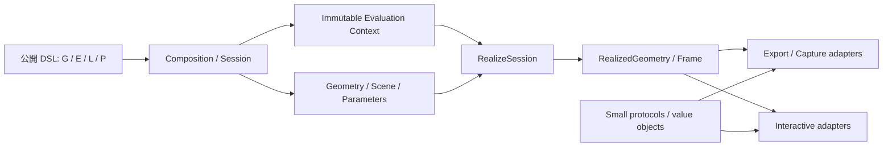

# `src/grafix` アーキテクチャ品質レビュー

- 実施日: 2026-07-21
- 対象: `src/grafix/` を中心に、関連する `tests/architecture/`、`architecture.md`、`docs/architecture_visualization.md`
- 観点: アーキテクチャ、責務の分離、美しさ、シンプルさ、可読性
- 基準コミット: `74a8643`

## 1. 結論

Grafix の骨格は良い。特に、`Geometry` を不変な遅延 DAG として扱い、`RealizedGeometry` を境界で厳格に検証し、公開 API を `G` / `E` / `L` に集約している点は、creative coding 向けライブラリとして明快で美しい。トップレベルの依存方向も architecture test によって守られている。

一方、現在もっとも危険なのは、**評価 cache を `(GeometryId, registry revision)` で識別するモデルと、実際には preview quality、runtime config、font asset にも依存する実装が一致していないこと**である。これは単なる整理不足ではなく、同じ cache key に異なる結果が対応し得る整合性の問題である。これとは別に、config と registry の process-global な所有も session isolation を弱くしている。

次に大きいのは、公開面のシンプルさを維持するための複雑さが、`DrawWindowSystem`、`ParameterGUI`、`api.runner`、`effects/util.py` など少数の巨大モジュールへ集中している点である。また、`ParamStore` の private state を外側から直接復元・変更する箇所があり、所有権の境界が実装上は崩れている。

全面的な再設計は不要である。まず評価コンテキストと session 所有権を明示し、その後に巨大な調停役を小さな責務へ分けるのがよい。互換 shim、汎用 DI コンテナ、イベントバスの導入は避け、既存の良いデータモデルを中心に据えるべきである。

## 2. 観点別評価

| 観点 | 評価 | 要点 |
|---|---|---|
| アーキテクチャ | 骨格は良いが、実行時の依存が型と cache key に現れていない | パッケージの依存方向は明瞭。一方、ambient state が評価の同一性を壊している |
| 責務の分離 | core の幾何モデルは良好、application/UI orchestration は過密 | `Geometry` / `RealizedGeometry` は凝集しているが、window、GUI、runner が多責務 |
| 美しさ | 公開 DSL は美しいが、private access と import-order workaround が対照的 | 利用者が見る API と内部所有権の品質に差がある |
| シンプルさ | 表面はシンプル、内部は局所的に複雑 | 大規模な抽象化乱立ではなく、少数の巨大ファイルとグローバル状態への集中が主因 |
| 可読性 | 型、docstring、architecture test は強いが、主要制御フローを追いにくい | 長大な class/function、重複した publish 手順、registry の副作用が理解を妨げる |

## 3. 優先度

- **P0**: 即時修正が必要な致命的問題。今回該当なし。
- **P1**: correctness、cache identity、session isolation、状態所有権に関わる問題。新機能追加より先に直したい。
- **P2**: 変更コスト、責務分離、理解容易性を明確に悪化させている構造問題。
- **P3**: 局所的な保守性・可読性改善。上位問題の後でよい。

## 4. 指摘一覧

| ID | 優先度 | 指摘 |
|---|---:|---|
| AQ-001 | P1 | preview quality が effect の content cache identity に含まれない |
| AQ-002 | P1 | text primitive の外部 font/config 依存が identity に含まれない |
| AQ-003 | P1 | `RenderSession` の設定と preset が process-global で session 分離されていない |
| AQ-004 | P2 | `ParamStore` の private layout を API/GUI が直接操作している |
| AQ-005 | P2 | `DrawWindowSystem`、`ParameterGUI`、`api.runner` が application の巨大な調停役になっている |
| AQ-006 | P2 | effect 間共有を `effects/util.py` 一つへ集約した結果、kernel の責務境界が消えている |
| AQ-007 | P2 | registry が import cycle、二重登録方式、全体 revision を生んでいる |
| AQ-008 | P2 | パッケージ境界は構文上きれいだが、意味上の依存方向が一部逆転している |
| AQ-009 | P2 | capture/export の staging・path 割当・retry・cleanup が複数箇所に重複している |
| AQ-010 | P2 | G-code exporter が geometry にない face 意味論を形状と順序から推測している |
| AQ-011 | P2 | GUI/GL backend 抽象が未完で、frame 順序と context 所有権が漏れている |
| AQ-012 | P3 | benchmark runner が定義・実行・集計・workload を一ファイルで所有している |

## 5. 詳細

### AQ-001 [P1] preview quality が effect の content cache identity に含まれない

#### 根拠

- `src/grafix/core/effect_registry.py:44-67` では effect の既定 cache policy が content cache である。
- `src/grafix/core/geometry.py:187-221` の `GeometryId` は op、inputs、args から構成される。
- `src/grafix/core/realize.py:244-314` の cache key と cache 可否判定には registry revision は入るが、preview quality は入らない。
- `src/grafix/core/effects/reaction_diffusion.py:418-435,511-532,579-587,604-635`、`metaball.py:707-717,789-874`、`growth.py:1022-1033,1146-1170,1218-1232` は評価中に `current_preview_quality()` を参照する。
- interactive 側は `src/grafix/interactive/runtime/scene_runner.py:74-83,514-538` で draft/final 用 session を分けており、現状の主要経路では偶然衝突を避けている。

#### 問題

同じ `GeometryId` と registry revision に対し、ambient な quality によって異なる座標列が生成され得る。`RealizeSession` 自体はこの差を知らないため、呼び出し順によって draft 結果を final として再利用する、またはその逆が起こり得る。interactive の二重 session は局所的な回避策であり、core の不変条件にはなっていない。

#### 推奨

preview quality を評価の明示入力にし、`RealizeSession` が所有する小さな immutable evaluation context、または cache fingerprint に含める。修正までの短期策として、ambient quality を読む effect は content cache を無効にする。個別 effect 内で cache を手動調停するのではなく、評価器の一箇所で identity を定義する。

---

### AQ-002 [P1] text primitive の外部 font/config 依存が identity に含まれない

#### 根拠

- primitive も `src/grafix/core/primitive_registry.py:43-65` で既定が content cache である。
- `src/grafix/core/primitives/text.py:521-537` の `text` primitive は通常の primitive として登録される。
- 同ファイル `:602-605` と `src/grafix/core/font_resolver.py:65-107,131-168` は runtime config、filesystem 上の font、face index を評価時に解決する。
- `TextRenderer._fonts` は `src/grafix/core/primitives/text.py:89-126` の class-global cache であり、path/index ごとに増える。
- `clear_glyph_caches()` (`:238-243`) は glyph cache を消すが、font object cache の所有権とは一致していない。

#### 問題

文字列と引数が同じでも、config の切替、font file の置換、font 探索結果の変化によって geometry は変わる。一方、その差は `GeometryId` に現れない。さらに font cache は process lifetime に結び付いており、session の終了や cache clear と対応しない。

#### 推奨

解決済み font asset の fingerprint を evaluation context に含める。最低限、canonical path、face index、安定した file identity を使い、再現性を強く求める経路では content digest を選べるようにする。`TextRenderer` と font cache は session/resource owner に所属させ、上限と clear の意味を明示する。singleton と class-level cache の併用はやめる。

---

### AQ-003 [P1] `RenderSession` の設定と preset が process-global で session 分離されていない

#### 根拠

- `src/grafix/core/runtime_config.py:180-185,221-246` は explicit path と config/report cache を module global に持ち、`runtime_config_scope()` は LIFO 前提の process-global scope である。
- `src/grafix/api/render.py:220-227,381-390` はその scope を `RenderSession` の生成から `close()` まで保持する。
- `src/grafix/api/presets.py:23,36-70,92-102` は `_AUTOLOAD_KEY`、`sys.modules`、グローバル preset registry を使って config ごとの module を import する。
- `src/grafix/core/preset_registry.py:150-151` の registry は process-global であり、同名 preset の再登録は `:103-105` で拒否される。

#### 問題

session A と B を同時に保持した場合、後から開いた scope が process 全体の config を変更する。close 順が LIFO でない場合は、残っている session と global config の対応が崩れる。preset も config ごとの catalog ではなく、過去に import された process-global registry の累積になるため、複数 project/config の同居で衝突または混入が起きる。

#### 推奨

`RenderSession` の構築時に effective `RuntimeConfig` と preset catalog を確定し、以後は明示参照として渡す。既定 config の探索だけを process-level convenience として残してよいが、評価期間全体を global scope で包まない。preset module の import と catalog 作成を分け、session ごとの immutable snapshot を使う。

---

### AQ-004 [P2] `ParamStore` の private layout を API/GUI が直接操作している

#### 根拠

- `src/grafix/api/variation_batch.py:402-436` は `_variations_ref`、`_snapshot_cache`、`vars(store)` を読み、復元時に `vars(store).clear()` / `update()` で全属性を書き戻す。
- `src/grafix/interactive/parameter_gui/store_bridge.py:1297-1323` は store の private な collapsed-header state と revision 更新へ直接触れる。
- 同ファイル `:1369-1389` と `src/grafix/interactive/parameter_gui/table.py:1446-1461,1589-1593` は live container を GUI 側へ渡して変更する。
- `docs/architecture_visualization.md:393-405` は、外側から `ParamStore` 内部を直接変更せず operation 経由で更新する方針を記述している。

#### 問題

`ParamStore` の属性追加、cache 方針変更、不変条件追加が API/GUI の破壊につながる。特に `vars(store)` の全置換は、store が所有すべき identity、lock、observer、将来の slot 化を外側が暗黙に知っている。実装上の「完全復元」を優先した結果、抽象境界が存在しない状態になっている。

#### 推奨

`ParamStore` 自身に immutable checkpoint/memento と restore operation を持たせる。GUI 用には collapsed state、variation mutation、revision 更新を一つの公開 command として提供し、live mutable container を返さない。汎用 transaction framework は不要で、現に必要な `checkpoint()`、`restore()`、`set_collapsed(...)` 程度の狭い API でよい。

---

### AQ-005 [P2] application の調停役が巨大化している

#### 根拠

- `src/grafix/interactive/runtime/draw_window_system.py:153-1909` の `DrawWindowSystem` は約 1,750 行あり、window 初期化、入力、capture、recording、export、reload、diagnostics、frame 描画、終了処理を所有する。
- `src/grafix/interactive/parameter_gui/gui.py:366-2025` の `ParameterGUI` は約 1,660 行あり、variation、MIDI、range、reconcile、diagnostics、toolbar、table、renderer lifecycle を束ねる。
- `src/grafix/api/runner.py` は 1,236 行で、`run()` だけでも `:738-1236` の約 500 行を占める。thumbnail、parameter persistence、MIDI、Cocoa/screen layout、diagnostic/recovery まで扱う。
- `architecture.md:343-348` は runner を composition/wiring の場所と説明しており、現実の責務量と乖離している。

#### 問題

いずれも単なる長さではなく、変更理由が複数ある。たとえば capture の変更で window lifecycle を読み、GUI toolbar の変更で MIDI/reconcile を読み、起動オプションの変更で macOS layout/recovery まで確認する必要がある。制御フローの中心が大きすぎるため、単体テスト可能な seam も見つけにくい。

#### 推奨

既存 class を丸ごと wrapper で包むのではなく、所有する state の寿命に沿って分ける。

- `DrawWindowSystem`: frame coordinator、capture/recording coordinator、window/input lifecycle
- `ParameterGUI`: GUI session、panel/controller 群、backend lifecycle
- `api.runner`: config を確定する composition root と、platform/window placement policy

親 coordinator は順序だけを記述し、I/O や状態遷移の詳細を持たない形を目標にする。class-per-function にはしない。

---

### AQ-006 [P2] `effects/util.py` に kernel の責務が集中している

#### 根拠

- `src/grafix/core/effects/util.py` は 2,899 行で、22 個の effect から参照される。
- 内容は packed geometry (`:23-72`)、planar ring (`:76-170`)、grid (`:173-358`)、planar/PCA (`:361-1097`)、raster/EDT/SDF (`:1104-1468`)、graph/marching (`:1472-2004`)、resampling (`:2008-2899`) と、互いに異なる概念を含む。
- packed geometry の空値・pack helper は `src/grafix/core/realized_geometry.py:12-22,218-239` にも存在し、保証内容が二系統になっている。

#### 問題

「effect 同士を import しない」という良い規則が、「共有処理はすべて util に置く」という別の catch-all を生んでいる。変更の影響範囲が読みにくく、名前空間からアルゴリズムの所属が分からず、同種 helper の重複も発見しにくい。

#### 推奨

effect 固有ではない数値処理を、たとえば `core/geometry_kernels/{packed,planar,raster,graph,resample}.py` のような概念単位へ移す。packed geometry の生成・検証は canonical implementation を一つにする。分割基準は行数ではなく、入力型、不変条件、数値領域で定める。

---

### AQ-007 [P2] registry の責務と変更単位が広すぎる

#### 根拠

- `src/grafix/api/effects.py:11-12,41-42`、`api/primitives.py:16-21`、`api/preset.py:26-27` には parameters と registry の import cycle を避けるための import 順序・遅延 import がある。
- builtin は `src/grafix/core/builtins.py:1-79` の手書き import list と、`effect_registry.py:158-182` / `primitive_registry.py:125-149` の decorator side effect の二段階で登録される。
- `src/grafix/core/operation_selector.py:160-170,192-294,329-343` は selector spec の初回登録または対象 catalog fingerprint 変更時に、評価器 registry へ private spec を登録して全体 revision を増やす。
- `src/grafix/core/realize.py:107-110,244-247` は registry 全体の revision を cache key に使う。

#### 問題

parameter schema、公開 decorator、evaluator、UI metadata、bootstrap が registry 周辺で相互参照している。新しい builtin module の追加には import list と decorator の両方を理解する必要がある。また、selector spec の初回登録は private UI 用 spec であっても registry 全体の revision を増やす。対象 catalog が変わる場合は元の registry 変更ですでに cache が失効するが、selector の再生成も同じ粗い revision history に結合している。

#### 推奨

登録方式を一つに絞る。明示 bootstrap を採るなら decorator は spec を作るだけにし、中央 bootstrap が catalog を組み立てる。自己登録を採るなら手書き二重 list をなくす。parameter schema は registry から独立した neutral module に置き、selector catalog は evaluator catalog と分離する。cache fingerprint は registry 全体ではなく、実際に参照した op/spec の版に狭める。

---

### AQ-008 [P2] 構文上の package boundary と意味上の boundary が一致していない

#### 根拠

- `tests/architecture/test_dependency_boundaries.py:178-215` は `core -> api/export/interactive`、`export -> api/interactive`、`interactive -> api` などのトップレベル依存を禁止しており、現状は通過する。
- 一方、`src/grafix/core/capture_provenance.py:340-461` は filesystem、`inspect`、Git subprocess を扱い、`capture_manifest.py:182-393` は staging、fsync、link、rollback、publish を扱う。`output_paths.py:287-346` も出力配置 policy を持つ。
- interactive 内では `gl/draw_renderer.py:23` と `midi/midi_controller.py:21` が runtime diagnostics を import し、`parameter_gui/gui.py:43-45` が runtime clock/monitor を import する一方、runtime 側も GL/MIDI/GUI を組み立てる。

#### 問題

トップレベルの矢印は正しくても、`core` が pure domain と infrastructure の両方を受け持ち、interactive の sibling package が composition layer である runtime に依存している。結果として low-level adapter が high-level orchestration の型を知り、再利用や isolated test が難しくなる。

#### 推奨

`core` には geometry、scene、parameter semantics、評価 protocol を残し、Git/fsync/output path policy は capture/export 側の infrastructure としてまとめる。interactive で共有する diagnostics/clock は `interactive/contracts` などの小さな neutral module に置き、runtime はそれを実装・配線する。新しい抽象階層を増やすのではなく、逆向き import を生む value object/protocol だけを移す。

---

### AQ-009 [P2] capture/export の周辺 orchestration が重複している

#### 根拠

- `src/grafix/interactive/runtime/draw_window_system.py:653-731` は通常 SVG の staging directory 作成、path allocation、late-collision retry、cleanup を行う。
- 同ファイル `:894-998` は別経路の SVG export/send、`:1170-1231` は video 用の path allocation、manifest 準備、retry、cleanup を扱う。
- `src/grafix/interactive/runtime/export_job_system.py:394-470` は worker staging path の検証、公開、cleanup を調停する。
- commit/rollback 自体は `src/grafix/core/capture_manifest.py:313-393` の `publish_capture_generation()` に共通化され、SVG/worker は `src/grafix/export/capture.py:238-294` の `CaptureService.publish_staged()` 経由で利用している。video も同じ core primitive を直接利用する。

#### 問題

atomic commit/rollback の中心はすでに一つであり、これは良い。一方、その手前にある staging directory、path allocation、late-collision retry、manifest 準備、cleanup の lifecycle は形式・同期/worker 経路ごとに散っている。新しい export format や競合方針を追加すると、周辺の成功・失敗経路を同期して変更する必要がある。

#### 推奨

既存の `publish_capture_generation()` を atomic commit の唯一の primitive として維持し、その上に「staging を準備し、候補 path を割り当て、late collision を再試行し、最後に cleanup する」狭い lifecycle helper を置く。format 固有の encode と manifest 作成は分けたままにし、capture と video を一つの巨大 service へ統合しない。

---

### AQ-010 [P2] G-code exporter が face 意味論を推測している

#### 根拠

- `RealizedGeometry` は基本的に `coords` と `offsets` を持つ packed polyline であり、face/group の意味論を保持しない。
- `src/grafix/export/gcode.py:347-387` の `_polyline_face_block_ids()` は「3 頂点以上を ring 候補」とし、入力順序から face block を推測する。
- 同ファイル `:605-660` はその block を travel optimization の境界として使う。
- docstring 自身も `fill(remove_boundary=True)` では face grouping が失われ、単一 block になることを明記している。

#### 問題

3 頂点以上の開いた polyline も ring とみなされる一方、境界を除去した fill は face を識別できない。exporter が producer 固有の出力順に依存し、geometry contract に存在しない意味を復元しているため、effect の内部順序変更が G-code 最適化の意味を変える。

#### 推奨

face/group が必要な export 経路では、明示的な stroke group view または metadata を渡す。汎用 `RealizedGeometry` にすべての意味を詰める必要はなく、`fill` から exporter へ渡す optional grouping artifact でよい。推測 fallback を残す場合も、閉曲線判定と「意味論なし」を区別する。

---

### AQ-011 [P2] GUI/GL backend 抽象が frame 順序と context を隠せていない

#### 根拠

- `src/grafix/interactive/parameter_gui/pyglet_backend.py:73-85` は display size、framebuffer scale、delta time を ImGui IO へ同期する。
- `src/grafix/interactive/parameter_gui/gui.py:1870-1874` は `imgui.new_frame()` の後にその同期を呼ぶため、現在 frame ではなく前 frame の IO 値を使う順序になっている。
- 同ファイル `:512-528,1989-1994` は GUI 本体が ImGui context/renderer 作成と GL clear を直接扱う。
- `src/grafix/interactive/runtime/draw_window_system.py:1557-1562,1725-1729` は renderer の `ctx.screen` へ直接到達する。

#### 問題

backend が存在するにもかかわらず、frame lifecycle と GL resource ownership が GUI/runtime へ漏れている。これは backend 交換を難しくするだけでなく、現状の `new_frame()` 順序のように、抽象境界をまたいだ correctness issue を見逃しやすくする。

#### 推奨

backend に `begin_frame()` / `render()` / `close()` の最小 lifecycle を持たせ、IO 同期を `new_frame()` より前に一箇所で行う。renderer は framebuffer target を意味のある型で公開し、runtime が `ctx` の内部構造を辿らないようにする。

---

### AQ-012 [P3] benchmark runner が定義・実行・集計・workload を一ファイルで所有している

#### 根拠

- `src/grafix/devtools/benchmarks/runner.py` は 3,780 行ある。
- case catalog は `:70-503`、process isolation/execution は `:504-1212`、case definition 群は `:1213-1933`、各 subsystem の workload は `:1934-3685`、serialization/CLI は `:3686-3780` に同居する。

#### 問題

benchmark の追加時に runner protocol、集計、既存 workload の巨大な名前空間を横断する。production path ではないため優先度は低いが、性能回帰を安全に観測する基盤としては変更衝突と理解コストが高い。

#### 推奨

`model.py`、`executor.py`、`metrics.py`、`catalog.py`、`workloads/` 程度に、データ契約と実行境界で分ける。workload ごとの micro-module 乱立は避け、parameter、effect、renderer、multiprocess など測定対象の subsystem 単位にまとめる。

## 6. 良い点

### 6.1 不変な遅延 Geometry と materialization 境界

`src/grafix/core/geometry.py` の不変 DAG、`src/grafix/core/realized_geometry.py` の packed representation、`src/grafix/core/realize.py` の bounded cache/in-flight 管理は、ライブラリの中心として責務が明確である。effect の no-op 時に入力を再利用する設計も、意味と性能が一致している。

### 6.2 公開 API の表現力と小ささ

`G` / `E` / `L` / `P` によって、利用者は registry や evaluator を意識せず作品を記述できる。`src/grafix/api/__init__.py:61-66` が runner を lazy import しており、通常 import と interactive dependency を分離している点もよい。

### 6.3 package dependency の機械的な保護

`tests/architecture/test_dependency_boundaries.py` は、設計文書だけでなく AST ベースで top-level dependency を検証している。今回確認した範囲では forbidden dependency はなく、architecture skeleton は実際に守られている。

### 6.4 I/O 境界の堅牢性

capture manifest の staging、fsync、rollback、publish や、exporter の検証・atomic write は丁寧である。AQ-008/AQ-009 は機能の質を否定するものではなく、堅牢な primitive の配置と、その周辺 orchestration の分散・重複を問題としている。

### 6.5 型・docstring・診断情報

公開型、NumPy style docstring、diagnostic model は全体として充実している。mypy と ruff が `src/grafix` 全体で通る状態は、今後の責務分割を安全に進める基盤になる。

## 7. 推奨する改修順序

### Phase 1: 評価 identity と session isolation を直す

1. preview quality を `RealizeSession` の cache fingerprint に含める。
2. font/config/asset identity を明示する。
3. `RenderSession` から process-global config scope を除き、effective config を所有させる。
4. preset catalog を session ごとの snapshot にする。
5. ImGui IO 同期を `new_frame()` より前へ移す。

この phase は見た目の整理ではなく、同一入力・同一結果という前提の修復である。

### Phase 2: 状態所有権を閉じる

1. `ParamStore.checkpoint()` / `restore()` 相当を追加する。
2. variation/collapsed state の mutation を store operation に集約する。
3. API/GUI から `_...ref`、`vars(store)`、private revision 操作をなくす。
4. private access を禁止する architecture test または focused test を追加する。

### Phase 3: application orchestration を分割する

1. `DrawWindowSystem` から capture/recording state machine を分離する。
2. 既存 publish primitive の上で staging/path allocation/retry/cleanup lifecycle を共通化する。
3. `ParameterGUI` を session、panels、backend lifecycle に分ける。
4. `api.runner` を composition root と platform policy へ縮める。

一度に全面 rewrite せず、既存テストを保ったまま一つの state owner ずつ移す。

### Phase 4: kernel と registry を整理する

1. `effects/util.py` を数値領域ごとの kernel module に分ける。
2. packed geometry helper を一つにする。
3. builtin 登録を単一方式へ統一する。
4. evaluator catalog と selector/UI catalog を分ける。
5. registry 全体 revision ではなく参照 spec 単位の fingerprint を検討する。

### Phase 5: semantic boundary と devtools を整える

1. capture provenance/publish infrastructure を core domain から移す。
2. interactive 共通 protocol/value object を runtime 依存から切り離す。
3. G-code 用 grouping contract を明示する。
4. benchmark runner を model/executor/metrics/catalog/workloads に分ける。
5. 実装後に `architecture.md` と visualization を現実へ同期する。

## 8. 目標となる依存関係

重要なのは layer 数を増やすことではなく、**評価結果に影響するものを `ENV` に明示し、mutable state の owner を一つにすること**である。

## 9. 避けるべき対応

- 既存構造を残したまま compatibility wrapper や shim を追加する。
- global state を隠すだけの service locator / DI container を導入する。
- `DrawWindowSystem` の method を一対一で別 class に移し、責務は変えない。
- `effects/util.py` を機械的に同じ大きさへ分割し、概念境界を作らない。
- cache 不整合を interactive 側の session 分割だけで回避し続ける。
- architecture test を import 禁止だけに限定し、private state access や cache context の契約を検証しない。

## 10. 検証

実施した確認:

- `git status --porcelain` で開始時の作業ツリーが clean であることを確認。
- package import を AST で確認し、既存 dependency rule に対する新たな違反がないことを確認。
- `PYTHONPATH=src ... pytest -q -p no:cacheprovider tests/architecture/test_dependency_boundaries.py`
  - **7 passed**
- `... ruff check src/grafix tests/architecture/test_dependency_boundaries.py`
  - **All checks passed**
- `... mypy src/grafix`
  - **Success: no issues found in 240 source files**

未実施:

- full pytest suite
- macOS window、OpenGL、MIDI、ffmpeg を使う実機 interactive 動作確認
- benchmark の実測比較

したがって、本レビューは静的な構造レビューと focused architecture validation を中心とする。P1 の修正時には、同一 `Geometry` を異なる quality/config/font context で評価する回帰テストと、複数 `RenderSession` を交互に扱う isolation test を最初に追加すべきである。
